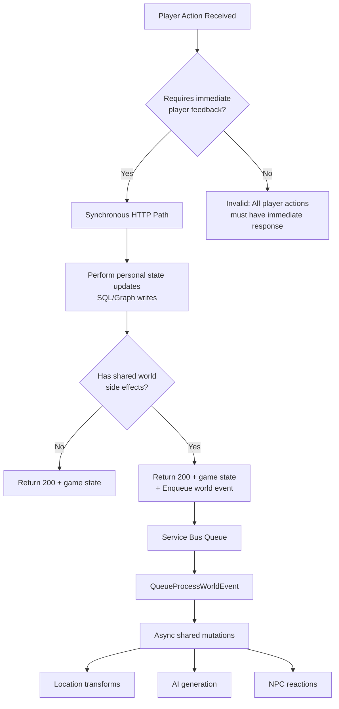

# Event Classification Matrix

> Status: ACTIVE (2025-11-24)  
> Purpose: Define classification patterns for real-time HTTP responses vs. async world event processing
>
> **Design Philosophy**: This matrix describes **common patterns**, not rigid rules. AI agents determine whether specific player actions trigger shared world events based on narrative context and world state. The deterministic code layer captures state for repeatable play, while AI provides immersive decision-making.

## Core Principle

**ALL player actions return immediately via HTTP 200/400/404.**

**Personal state changes** (move, get item, update inventory) are synchronous: HTTP handler updates SQL/Graph and returns new state.

**Shared world effects** (fire spreads, NPC spawns, location transforms) are asynchronous: HTTP handler enqueues event to Service Bus for eventual processing.

**AI Decision Authority**: Intent parser and narrative agents determine which actions produce shared world effects. The classification table below shows **typical patterns**, not exhaustive rules.

## Classification Decision Tree



## Event Classification Table

**Note**: These are **common patterns** observed in typical gameplay. AI agents may classify edge cases differently based on narrative context.

| Event Category              | Trigger Source | SQL/Graph Update              | Queue Event              | Latency Budget               | Typical Examples                                         |
| --------------------------- | -------------- | ----------------------------- | ------------------------ | ---------------------------- | -------------------------------------------------------- |
| **Personal State Change**   | Player HTTP    | ✅ Synchronous                | ❌ Usually none          | <500ms                       | Move north, Pick up item, Look around, Check inventory   |
| **Shared World Effect**     | Player HTTP    | ✅ Synchronous<br/>(personal) | ✅ Enqueued<br/>(shared) | HTTP: <500ms<br/>Queue: <30s | Set fire to forest, Trigger avalanche, Plant seed        |
| **NPC Awareness (Basic)**   | Player HTTP    | ✅ Synchronous                | ❌ None                  | <500ms                       | NPC notices player, Guard greeting, Shopkeeper welcome   |
| **NPC Behavior (Complex)**  | Queue Event    | ✅ Async                      | ✅ Only queue            | <5s                          | NPC alerts others, Enemy aggro spreads, NPC flees/moves  |
| **System Evolution**        | Timer/Schedule | ✅ Async                      | ✅ Only queue            | <60s                         | Weather change, Day/night cycle, Resource respawn        |
| **AI Generation**           | Queue Event    | ✅ Async                      | ✅ Only queue            | <10s                         | Description enrichment, Dynamic lore, Quest generation   |

## Detailed Rules

### Rule 1: HTTP Response Must Be Immediate

**Requirement**: All HTTP handlers MUST return within 500ms (p95 target).

**Enforcement**:

```typescript
// ✅ CORRECT: Immediate return with synchronous personal state updates
export async function handlePlayerAction(req: HttpRequest): Promise<HttpResponseInit> {
    // 1. Validate + perform personal state changes (SQL/Graph writes)
    const result = await performAction(playerId, action)
    // Examples: Update player.currentLocationId, add item to inventory, set quest flag

    // 2. If action has shared world effects, enqueue async event
    if (result.triggersSharedWorldEffect) {
        await enqueueWorldEvent(buildEventEnvelope(result))
        // Note: enqueueWorldEvent should be <50ms; if Service Bus is slow, log warning
    }

    // 3. Return immediately with success + new personal state
    return {
        status: 200,
        jsonBody: {
            success: true,
            playerState: result.newState, // Already persisted in step 1
            message: result.narrativeText
        }
    }
}

// ❌ WRONG: Waiting for queue processing before HTTP return
export async function handlePlayerAction(req: HttpRequest): Promise<HttpResponseInit> {
    const result = await performAction(playerId, action)

    // DON'T DO THIS - blocks HTTP response
    const worldResult = await processWorldEvent(result)

    return { status: 200, jsonBody: worldResult }
}
```

### Rule 2: AI-Driven Event Classification

**Design Tenet**: Lean on AI to create fully immersive worlds. The deterministic code layer captures state for repeatable play; AI provides contextual decision-making.

**AI Decision Points**:

1. **Intent Parser** (M4 AI Read): Analyzes player command text to determine:

    - Primary intent (move, interact, attack, etc.)
    - Target entities (NPCs, objects, locations)
    - Potential world impact (personal vs shared)

2. **Narrative Agent** (M4+): Evaluates world context to decide:

    - Does this action affect other players? → Enqueue shared event
    - Is this action significant enough to persist? → Update world state
    - Should NPCs react? → Enqueue reaction events

3. **Policy Validator** (M4+): Enforces game rules:
    - Physics constraints (can't set underwater fire)
    - Permission checks (player level/abilities)
    - Resource availability (tinderbox charges, NPC stock)

**Example Flow**:

```typescript
// Player command: "Ask barman for beer"
const intent = await intentParser.parse('ask barman for beer', context)
// intent.verb = 'interact', intent.target = 'barman', intent.object = 'beer'

const decision = await narrativeAgent.evaluateImpact(intent, worldState)
// decision.personalEffects = [inventory update, gold deduction]
// decision.sharedEffects = [] or [barman.stock decrease, barman.remembers_player]

// Apply personal effects synchronously
await applyPersonalEffects(decision.personalEffects)

// Enqueue shared effects if any
if (decision.sharedEffects.length > 0) {
    await enqueueWorldEvents(decision.sharedEffects)
}

return immediate200Response()
```

**Key Insight**: The same player command ("ask barman for beer") might produce different shared effects based on:

-   World state (barman's mood, stock levels, time of day)
-   Player history (first-time customer vs regular)
-   Narrative context (tavern is on fire vs peaceful evening)

### Rule 3: Personal vs Shared State Updates

**Personal State Changes** (synchronous in HTTP handler):

-   Player location (`currentLocationId` in SQL)
-   Player inventory (add/remove items)
-   Player quest flags or attributes
-   Personal relationship with NPCs (reputation)

**Shared World Effects** (asynchronous via queue):

-   Location description changes visible to all players
-   NPC spawns or behavior changes affecting future visitors
-   Environmental changes (fire, flooding, structural collapse)
-   World clock advancement or calendar events

**Example - "Ask barman for beer"**:

```typescript
// Synchronous: Update player inventory
player.inventory.push({ id: newGuid(), name: 'Ale', quantity: 1 })
await playerRepo.update(player)

// Synchronous: Update player gold
player.gold -= 5
await playerRepo.update(player)

// NO QUEUE EVENT: This only affects the requesting player's state
// Other players don't see your beer appear in your inventory

return {
    status: 200,
    jsonBody: {
        message: 'The barman slides a foaming tankard across the bar.',
        inventory: player.inventory,
        gold: player.gold
    }
}
```

**Example - "Set fire to tavern"**:

```typescript
// Synchronous: Update player state (used tinderbox)
player.inventory.find((i) => i.name === 'Tinderbox').charges -= 1
await playerRepo.update(player)

// Asynchronous: Enqueue shared world event
await enqueueWorldEvent({
    type: 'Location.Fire.Started',
    locationId: player.currentLocationId,
    intensity: 'high',
    spreadRadius: 2
})
// Queue processor will:
// - Add "burning" layer to tavern description
// - Trigger NPC flee reactions
// - Update adjacent locations ("smoke billows from the tavern")

return {
    status: 200,
    jsonBody: {
        message: 'Flames leap hungrily across the wooden beams!',
        inventory: player.inventory
    }
}
```

### Rule 4: Queue Events Are Fire-and-Forget

**Player never waits for queue processing.** The HTTP response includes:

-   Immediate game state (player location, inventory)
-   Optimistic narrative ("You light the tinder...")
-   Optional future state hint ("The forest will burn...")

Later, when the queue processor runs:

-   Forest location description layers updated
-   NPCs react to fire
-   Adjacent locations may be affected
-   Player sees changes on next `LOOK` command

### Rule 5: World Events Have Bounded Scope

Queue events SHOULD complete within their latency budget (see table above). If processing exceeds budget:

-   Emit telemetry warning
-   Consider splitting into smaller events
-   Review RU consumption and indexing

### Rule 6: Idempotency Key Includes Action Scope

For shared world effects, idempotency key MUST prevent duplicate effects:

```typescript
// Example: "Set fire to forest" action
const idempotencyKey = `player:${playerId}:fire:${locationId}:${minuteBucket}`

// This allows:
// - Same player can start fires in different locations
// - Different players can start fires in same location
// - Duplicate API calls within same minute collapse to one fire event
```

## Examples

### Example 1: Personal State Change (No Queue Event)

**Player Action**: `POST /player/{playerId}/move` with `direction: "north"`

**HTTP Handler Flow**:

1. Validate exit exists (Gremlin query)
2. Update player location (SQL API) - **synchronous write**
3. Return new location description
4. **No queue event** (personal state only, no shared world effect)

**Response Time**: ~200ms (p95)

**Response**:

```json
{
    "success": true,
    "location": {
        "id": "loc-forest-clearing",
        "name": "Forest Clearing",
        "description": "Sunlight filters through ancient oaks...",
        "exits": ["north", "south", "east"]
    }
}
```

**Key Point**: Player's `currentLocationId` is immediately persisted to SQL. Other players don't see this change (it's not a shared world effect).

### Example 2: Personal State Query (No Queue Event)

**Player Action**: `GET /player/{playerId}/inventory`

**HTTP Handler Flow**:

1. Validate player exists
2. **Synchronous read**:
    - Fetch inventory from SQL (partition key: `/playerId`)
3. Return inventory list
4. **No queue event** (read-only, personal state)

**Response Time**: ~150ms (p95, single partition query)

**Response**:

```json
{
    "success": true,
    "playerId": "player-uuid",
    "inventory": [
        { "id": "item-uuid-1", "name": "Torch", "quantity": 1 },
        { "id": "item-uuid-2", "name": "Rope", "quantity": 50 }
    ],
    "capacity": 20,
    "weight": 12
}
```

**Key Point**: Inventory reads are fast partition-scoped queries. No other player sees your inventory. No shared world effects.

### Example 3: Shared World Effect (With Queue Event)

**Player Action**: `POST /player/{playerId}/action` with `command: "set fire to the forest"`

**HTTP Handler Flow**:

1. Validate action (player has tinderbox, location is flammable)
2. **Synchronous writes** (personal state):
    - Deduct tinderbox charge from inventory (SQL)
    - Update player action timestamp (SQL)
3. **Enqueue world event**: `Location.Fire.Started` to Service Bus
4. Return optimistic response

**Response Time**: ~300ms (p95, includes Service Bus enqueue)

**Response**:

```json
{
    "success": true,
    "message": "You strike the tinderbox. Flames lick hungrily at the dry undergrowth.",
    "futureEffect": "The fire will spread...",
    "inventory": [{ "id": "tinderbox-uuid", "name": "Tinderbox", "charges": 4 }],
    "correlationId": "abc-123-def"
}
```

**Key Point**: Player gets immediate feedback + inventory update. Fire spreading happens asynchronously (affects all players who visit this location).

**Queue Event** (enqueued, processed async):

```json
{
    "eventId": "uuid-v4",
    "type": "Location.Fire.Started",
    "occurredUtc": "2025-11-24T12:34:56.789Z",
    "actor": { "kind": "player", "id": "player-uuid" },
    "correlationId": "abc-123-def",
    "idempotencyKey": "player:player-uuid:fire:loc-forest:1732454096",
    "version": 1,
    "payload": {
        "playerId": "player-uuid",
        "locationId": "loc-forest",
        "intensity": "moderate",
        "spreadRadius": 3
    }
}
```

**Queue Processor Flow** (async, <30s):

1. Dequeue event from Service Bus
2. Check idempotency (prevent duplicate fires)
3. **Shared world mutations** (visible to all players):
    - Add "burning" layer to forest location description (SQL)
    - Update adjacent location descriptions (Gremlin + SQL)
    - Trigger NPC reactions (enqueue `NPC.Flee` events)
    - Schedule fire spread events (future queue messages)
4. Emit telemetry: `Location.Fire.Started`
5. ACK message

**Player Experience**:

-   **Immediate**: Sees optimistic message + inventory update (tinderbox charges reduced)
-   **5-30s later**: Next player who does `LOOK` at forest sees updated description with fire layer
-   **Other players**: Also see burning forest on their next `LOOK`

### Example 4: NPC Reaction to Player Arrival

**Trigger**: Player moves to location with NPC

**Classification Decision**: NPC reactions to player arrival are **synchronous** (in HTTP response), not async queue events. This ensures players see immediate, contextual responses from NPCs when entering a location.

**Why Synchronous?**

-   Player immersion: "The guard eyes you suspiciously" should appear immediately, not on next `LOOK`
-   Narrative flow: Delayed reactions break the real-time feel of the game
-   AI context: The same HTTP handler that processes the move already has location + NPC context

**Flow**:

1. Player's move HTTP request received
2. Move handler queries NPCs at destination location (sync)
3. AI generates NPC awareness text based on player + NPC context (sync, <500ms budget)
4. Return location description + NPC reaction text immediately
5. **No queue event** for basic NPC awareness

**When to Use Queue Instead**:

-   **Cascading NPC effects**: NPC alerts other NPCs, triggering behavior changes
-   **Persistent NPC memory**: NPC "remembers" player for future interactions
-   **World state mutations**: NPC actions that affect shared world (e.g., NPC runs away, changing location state)

**Player Experience**:

-   Immediate: Sees location description + exits + NPC reaction ("The guard eyes you suspiciously")
-   Real-time feel: NPCs acknowledge player presence instantly

**Key Distinction**: Basic NPC awareness (greeting, noticing player) is synchronous for immersion. Complex NPC behaviors that affect shared world state use async queue events.

### Example 5: AI Description Generation (Queue-Only)

**Trigger**: Player enters new location for first time

**Flow**:

1. HTTP response returns base description immediately
2. Move handler enqueues `World.Ambience.Generate` event
3. Queue processor calls AI service (5-10s)
4. Generated layer persisted to `descriptionLayers` container
5. Emit telemetry: `AI.Layer.Generated`

**Player Experience**:

-   First visit: Base description only
-   Subsequent visits: Enriched description with AI layer

## Anti-Patterns

### ❌ Anti-Pattern 1: HTTP Handler Waits for Queue Processing

```typescript
// WRONG: Blocks HTTP response
const response = await httpHandler.move(playerId, 'north')
const worldEvent = await serviceBus.send(event)
const processed = await worldEventProcessor.process(worldEvent) // BLOCKS!
return processed
```

### ❌ Anti-Pattern 2: Queue Event Returns Data to HTTP

```typescript
// WRONG: Queue processor cannot send data back to HTTP client
// (HTTP connection already closed)
async function queueProcessor(event) {
    const result = await processWorldChange(event)
    // No way to send 'result' to original HTTP client!
}
```

### ❌ Anti-Pattern 3: Polling for Queue Completion

```typescript
// WRONG: Frontend polling defeats async purpose
async function movePlayer() {
    await fetch('/player/move', { method: 'POST' })

    // Don't poll for world event completion!
    while (!worldEventComplete) {
        await sleep(100)
        const status = await fetch('/world-event/status')
    }
}
```

**Correct**: Frontend simply calls `LOOK` again when player wants updated state.

## Migration Checklist: Converting Synchronous to Async

When refactoring a handler that currently blocks on world changes:

-   [ ] Extract world-modifying logic into separate function
-   [ ] Create world event envelope for that logic
-   [ ] Add idempotency key composition rules
-   [ ] Add event type to `WorldEventTypeSchema` enum
-   [ ] Implement queue processor handler for event type
-   [ ] Update HTTP handler to enqueue + return immediately
-   [ ] Add telemetry for both HTTP and queue paths
-   [ ] Update tests (HTTP tests verify enqueue, queue tests verify processing)
-   [ ] Document latency budget in this matrix
-   [ ] Add integration test for end-to-end flow (HTTP → queue → state change)

## Observability

### Telemetry Events

**HTTP Path**:

-   `Player.Action.Issued` (includes action type, correlationId)
-   `Player.Action.Completed` (includes latency, enqueued flag)

**Queue Path**:

-   `World.Event.Enqueued` (includes eventType, correlationId)
-   `World.Event.Processed` (includes latency, causationId)
-   `World.Event.Duplicate` (idempotency skip)
-   `World.Event.DeadLettered` (failure)

**Correlation**: All events include `correlationId` from original HTTP request.

### Dashboards

**Player Action Latency**:

```kusto
customEvents
| where name == "Player.Action.Completed"
| extend latencyMs = todouble(customDimensions.latencyMs)
| summarize p50=percentile(latencyMs, 50), p95=percentile(latencyMs, 95) by bin(timestamp, 5m)
| render timechart
```

**Queue Processing Lag**:

```kusto
customEvents
| where name in ("World.Event.Enqueued", "World.Event.Processed")
| extend correlationId = tostring(customDimensions.correlationId)
| summarize enqueuedAt=min(timestamp), processedAt=max(timestamp) by correlationId
| extend lagMs = datetime_diff('millisecond', processedAt, enqueuedAt)
| summarize p50=percentile(lagMs, 50), p95=percentile(lagMs, 95) by bin(enqueuedAt, 5m)
| render timechart
```

## References

-   [World Event Contract](./world-event-contract.md) - Event envelope schema and queue processing
-   [MVP Azure Architecture](./mvp-azure-architecture.md) - Infrastructure overview
-   [Copilot Instructions Section 3](../../.github/copilot-instructions.md) - Modeling rules
-   [Intent Parser Design](../modules/player-interaction-and-intents.md) - AI command parsing (M4)
-   ADR-002: Graph Partition Strategy - Dual persistence rationale
-   Issue #385: World Event Processing Infrastructure - Queue implementation epic
-   Issue #471: Intent Parser Phased Implementation - AI decision logic

## AI Flexibility & Edge Cases

### Design Philosophy Recap

**Deterministic code captures state. AI creates immersion.**

This matrix provides **implementation patterns**, not business rules. When implementing:

1. ✅ **DO**: Use these patterns as starting points
2. ✅ **DO**: Let AI agents decide contextual edge cases
3. ✅ **DO**: Capture AI decisions in telemetry for analysis
4. ❌ **DON'T**: Hard-code "move never triggers events" rules
5. ❌ **DON'T**: Bypass AI decision layer for "efficiency"

### Edge Case Examples

**"Move north" - Usually Personal, Sometimes Shared**:

-   **Typical**: Personal state change only (update location, return immediately)
-   **Edge Case**: Moving triggers trap → AI enqueues `Trap.Triggered` event
-   **Edge Case**: Moving into villain's lair → AI enqueues `NPC.Alerted` event
-   **Decision**: Intent parser + world context determines at runtime

**"Ask barman for beer" - Context-Dependent**:

-   **Simple tavern**: Personal transaction only (inventory + gold sync)
-   **Plot-critical barman**: AI enqueues `NPC.Interaction` to update barman memory
-   **Crowded tavern**: AI enqueues `NPC.QueueBuilds` to affect other customers
-   **Decision**: Narrative agent evaluates barman's role in story

**"Light torch" - Contextual Impact**:

-   **Normal dungeon**: Personal state (inventory update only)
-   **Gas-filled room**: AI enqueues `Location.Explosion` event
-   **Near sleeping dragon**: AI enqueues `NPC.Awakens` event
-   **Decision**: Policy validator checks world state constraints

### Implementation Guardrails

**Latency Budget Still Applies**:

-   AI decision-making (intent parse + narrative eval) MUST complete <500ms
-   If AI response too slow → fallback to personal-only classification
-   Enqueue "deferred evaluation" event for post-hoc analysis

**Telemetry Tracking**:

```typescript
track('AI.EventClassification', {
    command: rawText,
    intent: intent.verb,
    classification: decision.hasSharedEffects ? 'shared' : 'personal',
    confidence: decision.confidence,
    latencyMs: decision.latencyMs
})
```

**Progressive Enhancement**:

-   M1-M3: Hard-coded patterns (move=personal, fire=shared)
-   M4: AI intent parser classifies based on verb heuristics
-   M5+: Full narrative context evaluation with learned patterns

### Avoiding Over-Engineering

**Start Simple**: Don't build complex rule engines anticipating every edge case. Let AI surprise you with emergent behaviors.

**Measure First**: Track AI classification decisions in telemetry. Optimize patterns where latency or accuracy becomes an issue.

**Trust AI Judgment**: If AI decides "move north" should trigger a shared event in specific context, let it. Review telemetry to understand why.

---

**Last Updated**: 2025-11-25  
**Status**: ACTIVE - Descriptive patterns, not prescriptive rules. AI has final classification authority.
