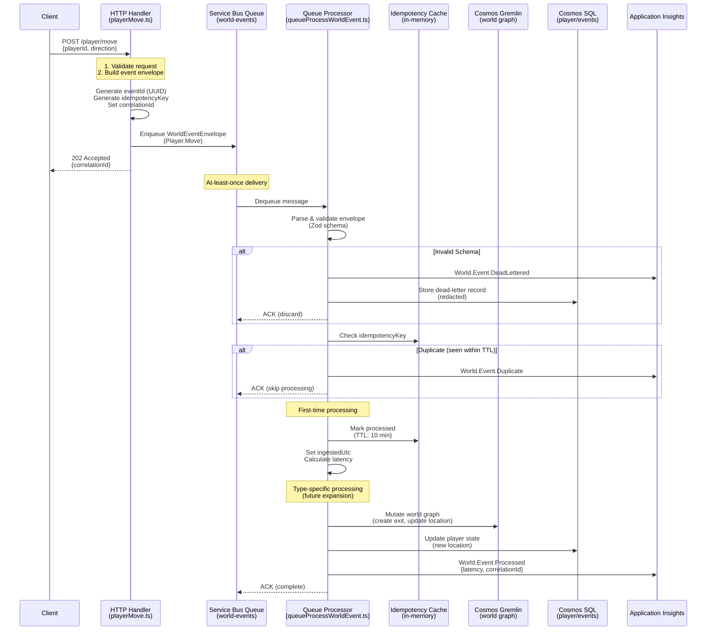

# World Event Contract

> Status (2025-10-22): IMPLEMENTED. Queue-triggered processor, envelope validation, and idempotency handling are now operational. See Implementation section below for code references.

> **Note**: This document specifies the **WorldEventEnvelope** contract for queue-based async processing (Service Bus). For the planned SQL API persistence model (WorldEvent interface with status tracking), see `shared/src/domainModels.ts` — that implementation is deferred, but the container is provisioned.

## Purpose

Provide a stable envelope + minimal semantic fields for all asynchronous world evolution operations (player actions, NPC ticks, system timers, AI proposals accepted after validation). Ensures idempotency, traceability, and correlation across processors.

## Implementation

The World Event Contract is now implemented with full queue processing capabilities:

-   **Schema Validation**: [`shared/src/events/worldEventSchema.ts`](../../shared/src/events/worldEventSchema.ts) — Zod schemas for envelope validation, actor types, and event type namespace
-   **Queue Processor**: [`backend/src/functions/queueProcessWorldEvent.ts`](../../backend/src/functions/queueProcessWorldEvent.ts) — Async world event processor with idempotency enforcement and telemetry
-   **Test Coverage**: [`backend/test/unit/worldEventProcessor.test.ts`](../../backend/test/unit/worldEventProcessor.test.ts) — Comprehensive tests covering valid events, schema validation, idempotency, and edge cases

**Telemetry Events Emitted:**

-   `World.Event.Processed` — Emitted when event is successfully processed (includes latency, correlation/causation IDs)
-   `World.Event.Duplicate` — Emitted when duplicate event is detected via idempotency key (skip processing)

See [`shared/src/telemetryEvents.ts`](../../shared/src/telemetryEvents.ts) for canonical event name definitions.

**M0 Foundation Milestone**: This implementation completed the core event processing infrastructure, documented in the M0 closure summary (Epic [#89](https://github.com/piquet-h/the-shifting-atlas/issues/89)).

## Event Flow Architecture

### Sequence Diagram: HTTP Action → Queue → Processor → Graph Mutation



### Flow Stages

1. **HTTP Ingestion**: Handler receives action, validates, constructs envelope
2. **Queue Emission**: Event published to Service Bus (async boundary)
3. **Dequeue & Validation**: Processor validates schema via Zod
4. **Idempotency Check**: In-memory cache with TTL prevents duplicate processing
5. **Processing**: Type-specific mutations (graph, SQL, external systems)
6. **Telemetry**: Success/duplicate/failure events emitted to Application Insights
7. **Acknowledgment**: Message completed or dead-lettered

## Envelope Shape

```jsonc
{
    "eventId": "uuid-v4", // Globally unique identifier
    "type": "Player.Move", // Namespaced type token (PascalCase segments)
    "occurredUtc": "2025-10-03T12:34:56.789Z", // ISO 8601 timestamp (producer clock)
    "ingestedUtc": "2025-10-03T12:34:57.012Z", // Set by first processor/ingestor
    "actor": {
        "kind": "player|npc|system|ai", // Controlled vocabulary
        "id": "uuid-v4" // Actor GUID if applicable
    },
    "correlationId": "uuid-v4", // Correlates to originating request / command
    "causationId": "uuid-v4", // (Optional) Upstream eventId for causal chains
    "idempotencyKey": "string", // Stable key for at-least-once delivery collapse
    "version": 1, // Schema major version
    "payload": {
        /* type-specific fields */
    }
}
```

## Required Fields

| Field          | Rule                    | Notes                                                                                     |
| -------------- | ----------------------- | ----------------------------------------------------------------------------------------- | --- | ------ | ---- |
| eventId        | UUID v4                 | Never reused.                                                                             |
| type           | 2-3 PascalCase segments | `Domain.Action` or `Domain.Subject.Action` mirroring telemetry style.                     |
| occurredUtc    | ISO timestamp           | Producer's notion of event creation.                                                      |
| actor.kind     | Enum                    | One of `player                                                                            | npc | system | ai`. |
| correlationId  | UUID v4                 | Propagated from HTTP request or upstream event.                                           |
| idempotencyKey | Non-empty string        | Deterministic for logical action (e.g., `playerGuid:fromLoc:toLoc:timestampFloorMinute`). |
| version        | Positive integer        | Increment only on breaking envelope change.                                               |
| payload        | Object                  | Must validate against type-specific schema.                                               |

## Optional Fields

| Field       | When Present              | Purpose                          |
| ----------- | ------------------------- | -------------------------------- |
| ingestedUtc | After first queue dequeue | Latency + ordering analysis.     |
| causationId | Derived events            | Build causal chains / timelines. |

## Type Namespace (Initial)

| Type                       | Payload Sketch                                          | Idempotency Guidance               |
| -------------------------- | ------------------------------------------------------- | ---------------------------------- |
| `Player.Move`              | `{ playerId, fromLocationId, toLocationId, direction }` | `playerId:from:to` + minute bucket |
| `Player.Look`              | `{ playerId, locationId }`                              | `playerId:locationId:minute`       |
| `NPC.Tick`                 | `{ npcId, locationId }`                                 | `npcId:tickWindow`                 |
| `World.Ambience.Generated` | `{ locationId, layerId, hash }`                         | `layerId`                          |
| `World.Exit.Create`        | `{ fromLocationId, toLocationId, direction }`           | `from:direction`                   |
| `Quest.Proposed`           | `{ questId, seedHash }`                                 | `questId`                          |

(Expand in future docs; do not overload `Player.Move` for teleportation—define a distinct `Player.Teleport` if invariants differ.)

## Validation Flow

1. **Envelope Validation** – Enforce presence + basic types.
2. **Type Schema Validation** – Zod/JSON Schema per `type`.
3. **Idempotency Check** – Consult durable store for processed `idempotencyKey`; skip if already finalized.
4. **Invariant Checks** – Domain-specific (exit exists, movement allowed).
5. **Persistence / Side Effects** – Apply graph mutations or append layers.
6. **Telemetry Emission** – Emit corresponding canonical event name aligned with `type`.

## Idempotency Strategy

### Overview

World event processing uses **in-memory idempotency cache** with TTL-based expiration to prevent duplicate processing under at-least-once delivery guarantees. The cache operates at the processor instance level with automatic eviction.

### Key Composition Rules

Idempotency keys must be **deterministic** and **unique per logical action**. Compose using stable entity identifiers and temporal bucketing:

**Pattern**: `<entityType>:<primaryId>[:<secondaryId>]:<action>:<timeBucket>`

**Examples**:

| Event Type                 | Key Composition                               | Rationale                                          |
| -------------------------- | --------------------------------------------- | -------------------------------------------------- |
| `Player.Move`              | `player:${playerId}:${fromId}:${toId}:${min}` | Unique per player + origin + destination + minute  |
| `Player.Look`              | `player:${playerId}:look:${locationId}:${min}` | Unique per player + location + minute              |
| `NPC.Tick`                 | `npc:${npcId}:tick:${tickWindow}`             | Unique per NPC + 5-minute window                   |
| `World.Exit.Create`        | `exit:${fromId}:${direction}`                 | Unique per origin + direction (no time bucket)     |
| `World.Ambience.Generated` | `layer:${layerId}`                            | Unique per layer (content-addressed or versioned)  |
| `Quest.Proposed`           | `quest:${questId}:proposed`                   | Unique per quest ID (one proposal per quest)       |

**Temporal Bucketing**:
- **Minute bucket**: `Math.floor(Date.now() / 60000)` — Use for high-frequency player actions
- **5-minute window**: `Math.floor(Date.now() / 300000)` — Use for periodic system events
- **Omit bucket**: For one-time structural changes (exit creation, layer generation)

**Do NOT include**:
- Event metadata (`eventId`, `correlationId`) — these differ per attempt
- Timestamps with millisecond precision — defeats deduplication
- Mutable state (player health, location version) — breaks determinism

### TTL Policy

**Configuration**:
```typescript
// Environment variable override (default: 10 minutes)
WORLD_EVENT_DUPE_TTL_MS=600000  // 10 min in milliseconds
```

**Rationale**: 10-minute TTL balances two concerns:
1. **Replay window**: Covers retry delays from Service Bus (default max: 5 minutes) plus client-side retries
2. **Memory efficiency**: Prevents unbounded cache growth with automatic expiration

**Cache Eviction**:
- **TTL expiration**: Entries older than TTL are removed on next access (lazy cleanup)
- **FIFO overflow**: When cache exceeds `WORLD_EVENT_CACHE_MAX_SIZE` (default: 10,000), oldest entry evicted
- **Per-instance scope**: Cache is not shared across processor instances (intentional — stateless design)

**Memory footprint** (typical):
- Entry size: ~150 bytes (idempotency key + eventId + timestamp)
- 10,000 entries ≈ 1.5 MB
- Eviction prevents runaway growth in high-throughput scenarios

### Implementation Details

**Cache Structure**:
```typescript
interface CacheEntry {
    eventId: string      // Original event ID for correlation
    timestamp: number    // Unix epoch ms for TTL calculation
}

const idempotencyCache = new Map<string, CacheEntry>()
```

**Lookup Algorithm**:
```typescript
function isDuplicate(idempotencyKey: string): boolean {
    const entry = idempotencyCache.get(idempotencyKey)
    if (!entry) return false
    
    const age = Date.now() - entry.timestamp
    if (age > DUPE_TTL_MS) {
        idempotencyCache.delete(idempotencyKey)  // Expired
        return false
    }
    return true  // Duplicate detected
}
```

**Storage**: In-memory only (current implementation). Future: optional Cosmos SQL container for cross-instance deduplication.

### Edge Cases

| Scenario                      | Behavior                                               |
| ----------------------------- | ------------------------------------------------------ |
| Duplicate within TTL          | Skip processing, emit `World.Event.Duplicate`          |
| Duplicate after TTL expiration| Reprocess as new event (acceptable for idempotent ops) |
| Cache overflow (>10k entries) | Evict oldest entry (FIFO), continue processing         |
| Processor restart             | Cache cleared (events may reprocess once)              |
| Multi-instance deployment     | Each instance has independent cache (no coordination)  |

**Correctness Guarantee**: Operations MUST be idempotent within TTL window. Reprocessing after expiration should not cause data corruption (e.g., exit creation uses "ensure" semantics, not "create if absent").

## Error & Retry Semantics

| Failure Class                | Action                                            | Telemetry Dimension                   |
| ---------------------------- | ------------------------------------------------- | ------------------------------------- |
| Transient (e.g., rate limit) | Retry with exponential backoff (bounded attempts) | `status=transient-retry`              |
| Permanent Validation         | Dead-letter (store reason)                        | `status=validation-failed` + `reason` |
| Idempotent Duplicate         | Ack & Skip                                        | `status=duplicate`                    |

Dead-letter payloads MUST include original envelope plus validation error summary.

## DLQ Monitoring & Investigation

### Dead-Letter Queue Overview

Failed world events are persisted to Cosmos SQL `deadLetters` container with automatic redaction of sensitive player data. For complete DLQ architecture, querying, and operational procedures, see [`docs/dead-letter-storage.md`](../dead-letter-storage.md).

### Quick Reference: DLQ Operations

**Monitor dead-letter rate**:
```kusto
customEvents
| where name == "World.Event.DeadLettered"
| where timestamp > ago(1h)
| summarize count() by tostring(customDimensions.reason), bin(timestamp, 5m)
| render timechart
```

**Query recent failures**:
```bash
npm run query:deadletters -- --start "2025-10-31T12:00:00Z" --end "2025-10-31T13:00:00Z"
```

**Investigate specific failure**:
1. Check Application Insights for `World.Event.DeadLettered` spike
2. Run query script with time range to retrieve dead-letter records
3. Analyze redacted envelope + error details for root cause
4. Fix schema/handler issue and deploy correction

### Alerting Thresholds

**Recommended alerts** (configure in Application Insights):
- Dead-letter rate > 10 per minute (sustained 5 min) → Indicates schema drift or client bug
- Failure category shift → New error type appeared (e.g., sudden `json-parse` spike)
- Storage write failures → DLQ infrastructure issue (check Cosmos DB health)

### Failure Categories

| Category            | Typical Cause                        | Resolution                                |
| ------------------- | ------------------------------------ | ----------------------------------------- |
| `schema-validation` | Client sent invalid envelope         | Update client to match schema             |
| `json-parse`        | Malformed message (encoding issue)   | Check Service Bus message producer        |
| `storage-failure`   | Cosmos DB unavailable                | Check infrastructure health, retry policy |

See [`docs/dead-letter-storage.md`](../dead-letter-storage.md) for:
- Redaction strategy (player ID masking, payload summarization)
- Query interface (programmatic + CLI)
- Manual cleanup procedures
- Security considerations

## Correlation & Tracing

-   `correlationId` links back to originating HTTP request or player session command.
-   Append `eventId` to telemetry dimensions of downstream AI or mutation proposals referencing the event.

## Versioning

-   Bump `version` only when envelope structure changes in a breaking way (field removal or semantic shift).
-   Additive payload fields within a `type` use separate **type schema versions** (maintained outside the envelope; optional `payloadVersion` can be added if needed later).

## Security Considerations

-   All externally influenced fields (notably `payload`) must be revalidated server-side; never trust client-provided `idempotencyKey` if reconstructable.
-   Reject events where `occurredUtc` drifts excessively (> configurable threshold) from `ingestedUtc` to mitigate replay.

## Open Questions

-   Should we encode shard / partition hints in the envelope for future horizontal scaling?
-   Need a policy for redaction of sensitive player data before dead-letter storage.

**Resolved (implemented in current code):**

-   ✅ Envelope structure — Now defined in Zod schema (`worldEventSchema.ts`)
-   ✅ Idempotency strategy — In-memory cache with TTL and FIFO eviction implemented
-   ✅ Error handling — Validation failures logged; placeholder for future dead-letter mode
-   ✅ Telemetry correlation — `correlationId` and `causationId` propagated through processing

## Queue Cutover Checklist (Direct Writes → Event Processing)

Mechanical steps to transition from synchronous HTTP persistence to queued world event processing without semantic drift:

1. Introduce envelope builder in HTTP handlers (produce full `WorldEvent` but still apply effects inline + persist event log record).
2. Add idempotency key store writes (record key before mutation); on duplicate skip mutation branch.
3. Stand up queue + processor Function(s) that consume events emitted by a feature‑flagged path (dual write: inline + enqueue).
4. Enable processor in shadow mode (processor re-validates but does not persist) and compare telemetry (`World.Event.Duplicate` vs processed).
5. Flip feature flag: HTTP handler stops applying mutation; only enqueues. Processor becomes authoritative.
6. Remove inline mutation code + dual write branch after stability window (>= one full playtest day) passes with no divergence.

Rollback: Re-enable inline apply path; processor continues (duplicate detection collapses replays).

Success Criteria: Zero drift events (no mismatched mutations), latency impact acceptable (< predefined threshold), and idempotency duplicates below target rate.

## Troubleshooting Guide

### Common Failures & Resolutions

#### 1. Schema Validation Failures

**Symptom**: `World.Event.DeadLettered` with `reason: 'schema-validation'`

**Root Causes**:
- Client sending invalid envelope structure (missing required fields)
- Type mismatch (e.g., string instead of UUID for `eventId`)
- Invalid `actor.kind` value (must be `player|npc|system|ai`)
- Malformed timestamp (not ISO 8601)

**Diagnosis**:
```bash
# Query dead-letter records for validation errors
npm run query:deadletters -- --start "2025-10-31T00:00:00Z" --end "2025-10-31T23:59:59Z" | grep "schema-validation"
```

**Resolution**:
1. Review `error.issues` in dead-letter record for specific field violations
2. Update event producer to match `WorldEventEnvelope` schema in `shared/src/events/worldEventSchema.ts`
3. Verify client is using correct version of shared package
4. Test with valid envelope from test suite (`backend/test/unit/worldEventProcessor.test.ts`)

---

#### 2. JSON Parse Failures

**Symptom**: `World.Event.DeadLettered` with `reason: 'json-parse'`

**Root Causes**:
- Service Bus message encoding issue
- Truncated message body
- Non-JSON payload (binary data, plain text)

**Diagnosis**:
```kusto
customEvents
| where name == "World.Event.DeadLettered"
| where tostring(customDimensions.reason) == "json-parse"
| where timestamp > ago(1h)
| project timestamp, customDimensions
```

**Resolution**:
1. Check Service Bus message producer for encoding configuration
2. Verify messages are sent as JSON with `Content-Type: application/json`
3. Inspect dead-letter record for truncated payload indicators
4. Review Azure Function Service Bus binding configuration

---

#### 3. Idempotency Cache Thrashing

**Symptom**: Unexpectedly low `World.Event.Duplicate` rate despite known retry behavior

**Root Causes**:
- TTL too short for actual retry delays
- Cache size limit exceeded (FIFO eviction removing recent entries)
- Idempotency key not deterministic (includes millisecond timestamps or random values)

**Diagnosis**:
```kusto
// Check duplicate rate vs processed rate
customEvents
| where name in ("World.Event.Processed", "World.Event.Duplicate")
| where timestamp > ago(1h)
| summarize count() by name, bin(timestamp, 5m)
| render timechart
```

**Resolution**:
1. Increase `WORLD_EVENT_DUPE_TTL_MS` to cover expected retry window (default: 10 min)
2. Increase `WORLD_EVENT_CACHE_MAX_SIZE` if high throughput (default: 10,000)
3. Review idempotency key composition — ensure deterministic, no random components
4. Consider Cosmos SQL-backed idempotency store for cross-instance coordination

---

#### 4. High Latency (Event Ingestion)

**Symptom**: `latencyMs` dimension in `World.Event.Processed` exceeding SLA (e.g., >5 seconds)

**Root Causes**:
- Service Bus queue depth buildup (backpressure)
- Cosmos DB throttling (429 errors) during processing
- Processor hanging on external calls (graph mutations, AI APIs)

**Diagnosis**:
```kusto
customEvents
| where name == "World.Event.Processed"
| where timestamp > ago(1h)
| extend latencyMs = todouble(customDimensions.latencyMs)
| summarize p50=percentile(latencyMs, 50), p95=percentile(latencyMs, 95), p99=percentile(latencyMs, 99) by bin(timestamp, 5m)
| render timechart
```

**Resolution**:
1. Check Service Bus queue metrics (Active Message Count, Dead-letter Count)
2. Scale processor function app (increase max instances or dedicated plan)
3. Review Cosmos DB RU consumption and throttling (see Performance Operations Dashboard)
4. Add `Timing.Op` instrumentation to identify slow operations in processor

---

#### 5. Duplicate Event Storms

**Symptom**: Sudden spike in `World.Event.Duplicate` events (>50% duplicate rate)

**Root Causes**:
- Client retry logic bug (exponential backoff not working)
- Service Bus duplicate detection disabled or misconfigured
- Multiple clients with same `idempotencyKey` generation logic

**Diagnosis**:
```kusto
customEvents
| where name == "World.Event.Duplicate"
| where timestamp > ago(1h)
| extend idempotencyKeyHash = tostring(customDimensions.idempotencyKeyHash)
| summarize count() by idempotencyKeyHash
| order by count_ desc
| take 10
```

**Resolution**:
1. Identify hot idempotency keys from hash distribution
2. Review client retry configuration (backoff delays, max attempts)
3. Enable Service Bus duplicate detection (1-minute window) for additional protection
4. Verify event producers are not reusing stale correlation/idempotency keys

---

#### 6. Missing Telemetry Events

**Symptom**: No `World.Event.Processed` or `World.Event.Duplicate` events in Application Insights

**Root Causes**:
- Application Insights sampling too aggressive (>85%)
- Telemetry initialization failure (connection string invalid)
- Function app cold start with telemetry buffer not flushed

**Diagnosis**:
```bash
# Check Function app logs for telemetry errors
az monitor app-insights component show --app <app-name> --resource-group <rg>
```

**Resolution**:
1. Verify `APPLICATIONINSIGHTS_CONNECTION_STRING` environment variable is set
2. Check sampling configuration (`APPINSIGHTS_SAMPLING_PERCENTAGE`) — ensure ≤50% for debugging
3. Add manual flush after telemetry emission in critical paths:
   ```typescript
   trackGameEventStrict('World.Event.Processed', props, metadata)
   await appInsights.defaultClient.flush()  // Ensure immediate send
   ```

---

### Performance Degradation Checklist

When event processing slows down:

1. **Check queue depth**: Service Bus active message count
2. **Check RU consumption**: Cosmos DB metrics (Graph + SQL API)
3. **Check processor instances**: Azure Function scale-out count
4. **Check latency percentiles**: P95/P99 for `World.Event.Processed`
5. **Check error rate**: `World.Event.DeadLettered` vs `World.Event.Processed` ratio
6. **Check idempotency cache hit rate**: Duplicate detection effectiveness

**Escalation Criteria**:
- P95 latency >10 seconds
- Error rate >5% sustained for 10 minutes
- Queue depth >1,000 messages growing
- RU throttling (429 errors) >10 per minute

## Code Examples

### Example 1: Emitting a Custom World Event

**Scenario**: HTTP handler enqueues a custom `Player.ItemPickup` event after validation.

```typescript
// backend/src/handlers/playerItemPickup.ts
import { ServiceBusClient } from '@azure/service-bus'
import type { HttpRequest, HttpResponseInit, InvocationContext } from '@azure/functions'
import { v4 as uuidv4 } from 'uuid'
import type { WorldEventEnvelope } from '@piquet-h/shared/events'

export async function playerItemPickup(
    request: HttpRequest,
    context: InvocationContext
): Promise<HttpResponseInit> {
    const { playerId, itemId, locationId } = await request.json()
    
    // 1. Validate request (omitted for brevity)
    
    // 2. Construct idempotency key (deterministic for this action + time bucket)
    const minuteBucket = Math.floor(Date.now() / 60000)
    const idempotencyKey = `player:${playerId}:pickup:${itemId}:${minuteBucket}`
    
    // 3. Build world event envelope
    const event: WorldEventEnvelope = {
        eventId: uuidv4(),
        type: 'Player.ItemPickup',  // Add to WorldEventTypeSchema enum
        occurredUtc: new Date().toISOString(),
        actor: {
            kind: 'player',
            id: playerId
        },
        correlationId: context.invocationId,  // Or from request header
        idempotencyKey,
        version: 1,
        payload: {
            playerId,
            itemId,
            locationId,
            timestamp: Date.now()
        }
    }
    
    // 4. Enqueue to Service Bus
    const serviceBusClient = new ServiceBusClient(
        process.env.SERVICEBUS_CONNECTION!
    )
    const sender = serviceBusClient.createSender('world-events')
    
    try {
        await sender.sendMessages({
            body: event,
            contentType: 'application/json'
        })
        
        context.log('Enqueued Player.ItemPickup event', {
            eventId: event.eventId,
            correlationId: event.correlationId
        })
        
        return {
            status: 202,
            jsonBody: {
                success: true,
                correlationId: event.correlationId
            }
        }
    } finally {
        await sender.close()
        await serviceBusClient.close()
    }
}
```

**Key Points**:
- Idempotency key includes time bucket to allow retries within same minute
- `correlationId` propagates from HTTP request for tracing
- Event sent to Service Bus immediately; HTTP returns 202 Accepted
- Processor handles actual inventory update asynchronously

---

### Example 2: Handling Custom Event in Processor

**Scenario**: Extend `queueProcessWorldEvent` to handle `Player.ItemPickup` type-specific logic.

```typescript
// backend/src/handlers/queueProcessWorldEvent.ts (add after line 296)

// Import type-specific handler
import { handlePlayerItemPickup } from './worldEventHandlers/playerItemPickup.js'

// Add to main processing switch (after idempotency check + telemetry)
export async function queueProcessWorldEvent(message: unknown, context: InvocationContext): Promise<void> {
    // ... existing validation + idempotency checks ...
    
    // 8. Emit telemetry (already present)
    trackGameEventStrict('World.Event.Processed', props, { correlationId: event.correlationId })
    
    // 9. Type-specific processing (NEW)
    try {
        switch (event.type) {
            case 'Player.Move':
                // Future: delegate to handlePlayerMove
                break
            
            case 'Player.ItemPickup':
                await handlePlayerItemPickup(event, context)
                break
            
            case 'NPC.Tick':
                // Future: delegate to handleNPCTick
                break
            
            // ... other types ...
            
            default:
                context.log('No type-specific handler for event type', {
                    type: event.type,
                    eventId: event.eventId
                })
        }
    } catch (handlerError) {
        context.error('Type-specific handler failed', {
            type: event.type,
            eventId: event.eventId,
            error: String(handlerError)
        })
        
        // Telemetry for handler failures
        trackGameEventStrict('World.Event.HandlerFailed', {
            eventType: event.type,
            eventId: event.eventId,
            errorMessage: String(handlerError)
        }, { correlationId: event.correlationId })
        
        throw handlerError  // Re-throw to trigger Service Bus retry
    }
    
    context.log('World event processed successfully', {
        eventId: event.eventId,
        type: event.type,
        latencyMs
    })
}
```

**Type-Specific Handler** (new file):

```typescript
// backend/src/handlers/worldEventHandlers/playerItemPickup.ts
import type { InvocationContext } from '@azure/functions'
import type { WorldEventEnvelope } from '@piquet-h/shared/events'
import { loadPersistenceConfigAsync } from '../../persistenceConfig.js'
import { CosmosInventoryRepository } from '../../repos/inventoryRepository.cosmos.js'

export async function handlePlayerItemPickup(
    event: WorldEventEnvelope,
    context: InvocationContext
): Promise<void> {
    const { playerId, itemId, locationId } = event.payload as {
        playerId: string
        itemId: string
        locationId: string
    }
    
    context.log('Processing Player.ItemPickup', {
        playerId,
        itemId,
        locationId
    })
    
    // 1. Load persistence config
    const config = await loadPersistenceConfigAsync()
    
    // 2. Update inventory in Cosmos SQL
    const inventoryRepo = new CosmosInventoryRepository(
        config.cosmosSql!.endpoint,
        config.cosmosSql!.database,
        config.cosmosSql!.containers.inventory
    )
    
    await inventoryRepo.addItem(playerId, {
        id: itemId,
        acquiredUtc: event.occurredUtc,
        locationId
    })
    
    // 3. Optionally update graph (item-location edge)
    // ... (omitted for brevity) ...
    
    context.log('Player.ItemPickup processed successfully', {
        playerId,
        itemId
    })
}
```

**Key Points**:
- Main processor delegates to type-specific handler
- Handler has access to full event envelope + context
- Failures propagate to main processor for Service Bus retry logic
- Telemetry for handler-specific failures

---

### Example 3: Building Causation Chains

**Scenario**: System event triggers derived events with causation tracking.

```typescript
// backend/src/handlers/systemEventGenerator.ts
import type { WorldEventEnvelope } from '@piquet-h/shared/events'
import { v4 as uuidv4 } from 'uuid'

/**
 * Generate derived events from a parent event (e.g., NPC reactions to player action)
 */
export async function generateDerivedEvents(
    parentEvent: WorldEventEnvelope
): Promise<WorldEventEnvelope[]> {
    const derivedEvents: WorldEventEnvelope[] = []
    
    // Example: Player moves → trigger NPC awareness check in destination location
    if (parentEvent.type === 'Player.Move') {
        const { toLocationId } = parentEvent.payload as { toLocationId: string }
        
        // Find NPCs in destination location (simplified)
        const npcIds = await findNPCsInLocation(toLocationId)
        
        for (const npcId of npcIds) {
            const npcEvent: WorldEventEnvelope = {
                eventId: uuidv4(),
                type: 'NPC.Awareness',  // New event type
                occurredUtc: new Date().toISOString(),
                actor: {
                    kind: 'system',  // System-generated event
                },
                correlationId: parentEvent.correlationId,  // Same correlation chain
                causationId: parentEvent.eventId,  // Link to parent event
                idempotencyKey: `npc:${npcId}:awareness:${toLocationId}:${Math.floor(Date.now() / 60000)}`,
                version: 1,
                payload: {
                    npcId,
                    locationId: toLocationId,
                    triggeredByPlayerId: (parentEvent.payload as any).playerId,
                    reason: 'player-entered'
                }
            }
            
            derivedEvents.push(npcEvent)
        }
    }
    
    return derivedEvents
}

// Helper (stubbed)
async function findNPCsInLocation(locationId: string): Promise<string[]> {
    // Query Cosmos Gremlin for NPCs at location
    return []  // Placeholder
}
```

**Causation Chain Visualization**:
```kusto
// Query Application Insights for causation chain
let rootCorrelationId = "your-correlation-id-here";
customEvents
| where name in ("World.Event.Processed", "World.Event.Duplicate")
| where tostring(customDimensions.correlationId) == rootCorrelationId
| extend eventId = tostring(customDimensions.eventId),
         causationId = tostring(customDimensions.causationId),
         eventType = tostring(customDimensions.eventType)
| project timestamp, eventId, eventType, causationId
| order by timestamp asc
```

**Key Points**:
- `causationId` links derived event to parent's `eventId`
- `correlationId` preserved across all events in causal chain
- Enables causality analysis and debugging event cascades

## Related Documentation

-   [Architecture Overview](./overview.md) – High-level architecture context and implementation mapping
-   [Agentic AI & Model Context Protocol](./agentic-ai-and-mcp.md) – AI integration using MCP tooling with world events
-   [M0 Closure Summary](../milestones/M0-closure-summary.md) – M0 Foundation milestone completion (world event infrastructure)
-   [ADR-001: Mosswell Persistence & Layering](../adr/ADR-001-mosswell-persistence-layering.md) – Base persistence model
-   [ADR-002: Graph Partition Strategy](../adr/ADR-002-graph-partition-strategy.md) – Dual persistence (graph vs SQL)
-   [Observability](../observability.md) – Telemetry framework and event tracking
-   [Dead-Letter Storage](../dead-letter-storage.md) – DLQ operations, redaction, and monitoring

---

**Status Evolution**: This contract graduated from DRAFT to IMPLEMENTED (2025-10-22) with the landing of the queue-triggered processor supporting multiple event type validations (6 initial types in schema) and end-to-end processing with idempotency and telemetry.

_Last updated: 2025-11-10 (added sequence diagram, idempotency key composition rules, DLQ procedures, troubleshooting guide, and code examples)_
