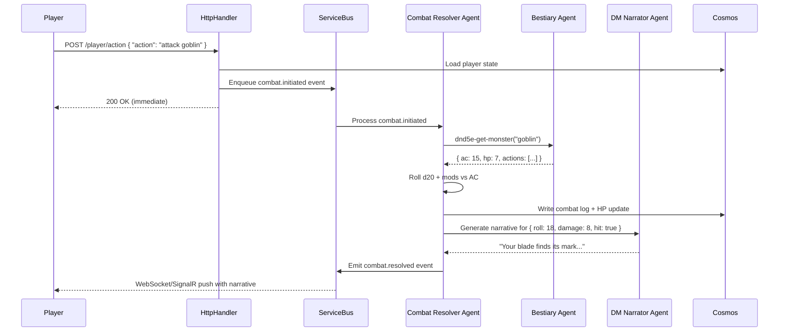

# D&D 5e API Integration via Azure Foundry Agents

**Status**: Design Proposal  
**Created**: 2026-01-30  
**Purpose**: Map D&D 5e SRD API endpoints to Azure Foundry multi-agent architecture for combat, spells, NPCs, and monsters.

---

## Executive Summary

Integrate D&D 5e System Reference Document (SRD) API into The Shifting Atlas via **Azure Foundry agents** to enable:

- Rules-accurate combat resolution
- Spell validation and narrative generation
- Monster/NPC behavior templates
- Equipment and magic item discovery

**Core Principle**: D&D API provides mechanics; Foundry agents transform mechanics into narrative via existing DM narrator persona.

**Architecture Decision (2026-01-30)**: **Hybrid approach** — Direct HTTP connections for read-only reference data; MCP tools for stateful operations.

- ✅ **Read-only lookups** → Direct HTTP (Foundry agent → D&D API)
- ✅ **Stateful operations** → MCP tools (Foundry agent → Backend → D&D API + Cosmos writes)

---

## Foundry Agent Topology

### 1. **Combat Resolver Agent** (`combat-resolver`)

**Foundry Configuration**:

- **Model**: `gpt-4` (reasoning-heavy for tactical decisions)
- **System Instructions**: Combat rules interpreter + dice simulator
- **HTTP Tools** (direct to D&D API):
    - `dnd5e-get-monster` (fetch monster stats)
    - `dnd5e-get-spell` (spell effects reference)
    - `dnd5e-get-condition` (status effects reference)
- **MCP Tools** (stateful operations):
    - `resolve-combat-round` (apply damage + persist state)
    - `world-get-entity-state` (fetch current HP/conditions from Cosmos)

**Responsibilities**:

- Calculate attack rolls (d20 + mods vs AC)
- Resolve damage (weapon dice + ability mods)
- Track initiative, conditions, and turns
- Emit structured combat log to Cosmos events collection

**Input Schema**:

```json
{
    "combatId": "guid",
    "participants": [
        { "type": "player", "entityId": "player-guid", "ac": 16, "hp": 45 },
        { "type": "monster", "dnd5eRef": "/api/2014/monsters/goblin", "instanceId": "npc-guid" }
    ],
    "action": {
        "actorId": "player-guid",
        "type": "attack|cast-spell|dodge",
        "target": "npc-guid",
        "weapon": "longsword" // or spellSlug
    }
}
```

**Output Schema**:

```json
{
    "roundNumber": 3,
    "rolls": [
        { "type": "attack", "roll": 18, "modifier": 5, "result": "hit" },
        { "type": "damage", "roll": 7, "modifier": 3, "total": 10 }
    ],
    "effects": [{ "entityId": "npc-guid", "hp": -10, "conditions": ["bleeding"] }],
    "narrative": "Your blade arcs through the dim light...",
    "combatComplete": false
}
```

---

### 2. **Magic & Spells Agent** (`spell-authority`)

**Foundry Configuration**:

- **Model**: `gpt-4o` (fast structured output for validation)
- **System Instructions**: Spell slot management + D&D magic rules
- **HTTP Tools** (direct to D&D API):
    - `dnd5e-get-spell-list` (query by level, school, class)
    - `dnd5e-get-spell-details` (full spell description)
    - `dnd5e-get-magic-item` (artifact properties)
- **MCP Tools** (stateful operations):
    - `validate-spell-cast` (check slots, components, range → persist slot consumption)
    - `world-get-player-state` (check spell slots, class)

**Responsibilities**:

- Validate if player/NPC can cast requested spell
- Calculate save DCs and area-of-effect
- Determine material component requirements
- Generate narrative description of spell effects

**Example Flow**:

```
Player: "I cast Fireball at the goblins"
→ Spell Authority validates:
  ✓ Player is wizard level 5+
  ✓ 3rd-level spell slot available
  ✓ Targets within 150 ft range
→ Returns: { dc: 15, damage: "8d6", saveType: "DEX", affectedTargets: ["goblin-1", "goblin-2"] }
→ DM Narrator: "You unleash arcane fury. The goblins scatter—one dives left..."
```

---

### 3. **Monster & NPC Catalog Agent** (`bestiary`)

**Foundry Configuration**:

- **Model**: `gpt-4o-mini` (read-heavy, low reasoning need)
- **System Instructions**: Monster filtering by CR, environment, type
- **HTTP Tools** (direct to D&D API):
    - `dnd5e-list-monsters-by-cr` (filtered search)
    - `dnd5e-get-monster-details` (full stat block)
- **MCP Tools** (stateful operations):
    - `spawn-wandering-npc` (create NPC entity in Cosmos with D&D stats)
    - `suggest-encounter-by-theme` (combine CR + location lore → NPC spawn)
- **System Instructions**: Lore retrieval + behavior pattern synthesis
- **MCP Tools**:
    - `dnd5e-list-monsters` (filter by CR, type, environment)
    - `dnd5e-get-monster` (stats, actions, lore)
    - `dnd5e-get-traits` (racial/species traits)
    - `world-spawn-entity` (create NPC instance in Cosmos)

**Responsibilities**:

- Suggest contextually appropriate monsters for encounters
- Provide stat blocks for combat resolution
- Generate NPC personality hooks from traits
- Cache frequently-used monsters (goblins, wolves, bandits)

**Wandering NPC Pattern**:

```typescript
// Queue trigger: QueueNPCBehaviorTick
const npc = await cosmosRepo.getEntity(npcId)
const baseStats = await bestiaryAgent.invoke({
    tool: 'dnd5e-get-monster',
    args: { slug: npc.dnd5eReference }
})

// Use baseStats.speed, alignment, senses to determine wandering behavior
if (baseStats.alignment.includes('chaotic')) {
    // Random movement weighted by time-of-day
}
```

---

### 4. **Character Rules Agent** (`character-authority`)

**Foundry Configuration**:

- **Model**: `gpt-4o-mini` (reference lookup)
- **System Instructions**: D&D class/race rules + capability validation
- **MCP Tools**:
    - `dnd5e-get-class` (proficiencies, features)
    - `dnd5e-get-race` (traits, ability bonuses)
    - `dnd5e-get-background` (skill proficiencies, starting equipment)
    - `world-get-player-background` (custom narrative background)

**Responsibilities**:

- Validate if player action aligns with class capabilities
- Suggest narratively plausible actions based on background
- Provide proficiency bonuses for skill checks
- Track level-based feature unlocks

**Integration with Narrative System**:

```
Player: "I use my sailor background to read these nautical charts"
→ Character Authority: { background: "sailor", proficiencies: ["navigator's tools", "water vehicles"], plausible: true }
→ DM Narrator: "Your sea-weathered eyes trace the lines... [success narrative]"
```

---

### 5. **Equipment & Treasure Agent** (`quartermaster`)

**Foundry Configuration**:

- **Model**: `gpt-4o-mini` (simple CRUD)
- **System Instructions**: Item properties + rarity-based generation
- **MCP Tools**:
    - `dnd5e-list-equipment` (filter by category, cost)
    - `dnd5e-get-magic-item` (properties, attunement)
    - `world-add-item-to-inventory` (Cosmos SQL API write)
    - `world-generate-loot-table` (procedural treasure)

**Responsibilities**:

- Procedurally generate treasure appropriate to location/encounter CR
- Validate item usage (attunement requirements, class restrictions)
- Calculate encumbrance (if tracked)
- Describe magic item discovery narratively

**Treasure Generation Example**:

```json
// Input: { encounterCR: 5, locationTheme: "ancient-library" }
// Output:
{
    "loot": [
        { "item": "Potion of Healing", "rarity": "common", "value": 50 },
        { "item": "Scroll of Identify", "rarity": "uncommon", "value": 100, "requiresAttunement": false },
        { "item": "Dusty Tome", "custom": true, "loreHook": "Contains fragmentary map to the Shifting Isles" }
    ],
    "narrative": "Beneath the toppled lectern, you find..."
}
```

---

## Foundry Project Structure

```
Azure AI Foundry Project: "The Shifting Atlas"
├── Agents:
│   ├── dm-narrator (existing) — Master narrative orchestrator
│   ├── combat-resolver — D&D combat mechanics
│   ├── spell-authority — Magic validation + effects
│   ├── bestiary — Monster stats + NPC generation
│   ├── character-authority — Class/race rules validation
│   └── quartermaster — Equipment + treasure
│
├── Connections:
│   ├── mcp-server (existing) — World state MCP tools
│   ├── dnd5e-api (new) — HTTP connector to www.dnd5eapi.co
│   └── cosmos-db (existing) — Direct data access for agents
│
├── Model Deployments:
│   ├── gpt-4 (combat, spells — reasoning-heavy)
│   └── gpt-4o-mini (bestiary, equipment — retrieval-heavy)
│
└── Prompt Flows: (future)
    └── combat-resolution-flow — Orchestrates multiple agents per combat round
```

---

## Hybrid Architecture: Direct HTTP vs MCP Tools

**Decision (2026-01-30)**: Use **direct HTTP connections** for read-only D&D reference data; reserve **MCP tools** for stateful operations that combine D&D mechanics with game state.

### Direct HTTP Connection (Foundry Portal)

**When to use**: Read-only D&D reference lookups (no game state changes).

**Setup**: In Foundry portal → **Connections** → **Generic HTTP**:

- **Base URL**: `https://www.dnd5eapi.co/api/2014`
- **Auth**: None (public API)
- **Headers**: `Accept: application/json`

**Endpoints registered as Foundry tools**:

| Tool Name                   | HTTP Method | Endpoint                          | Purpose                                   |
| --------------------------- | ----------- | --------------------------------- | ----------------------------------------- |
| `dnd5e-get-monster`         | GET         | `/monsters/{slug}`                | Fetch monster stat block                  |
| `dnd5e-get-spell`           | GET         | `/spells/{slug}`                  | Spell details (level, components, damage) |
| `dnd5e-get-equipment`       | GET         | `/equipment/{slug}`               | Weapon/armor stats                        |
| `dnd5e-list-monsters-by-cr` | GET         | `/monsters?challenge_rating={cr}` | Filter by challenge rating                |
| `dnd5e-get-class`           | GET         | `/classes/{slug}`                 | Class features and proficiencies          |
| `dnd5e-get-condition`       | GET         | `/conditions/{slug}`              | Status effects (poisoned, stunned)        |

**Pros**:

- ✅ Zero backend code to maintain
- ✅ Lower latency (no backend hop)
- ✅ Foundry handles retries/rate limiting
- ✅ Auto-generates tool schemas from HTTP config

**Cons**:

- ❌ No caching layer (but D&D API is fast ~50ms)
- ❌ Can't enrich responses with game-specific context
- ❌ No composite operations (must chain tool calls)

---

### MCP Tools (Backend Wrappers)

**When to use**: Stateful operations that combine D&D mechanics + Cosmos writes + telemetry.

**Implementation**: `backend/src/functions/mcp/tools/dnd5e/`

**Reserved for composite operations**:

| MCP Tool                    | Combines                                       | Writes To                         |
| --------------------------- | ---------------------------------------------- | --------------------------------- |
| `spawn-wandering-npc`       | D&D monster stats → NPC entity creation        | Cosmos (Players partition)        |
| `resolve-combat-round`      | Monster stats + player HP → damage calculation | Cosmos (combat log + HP update)   |
| `cast-spell-with-effects`   | Spell stats + slot validation → apply effects  | Cosmos (player state + event log) |
| `generate-treasure-from-cr` | Equipment/magic-item API → loot generation     | Cosmos (inventory writes)         |

**Pattern**:

```typescript
// MCP tool: spawn-wandering-npc
export async function spawnWanderingNpc(args: { locationId: string; monsterSlug: string; behavior: string }) {
    // 1. Fetch D&D monster stats (could also use direct HTTP, but allows caching)
    const monster = await dnd5eClient.getMonster(args.monsterSlug)

    // 2. Create NPC entity in Cosmos with game-specific fields
    const npc = await npcRepo.create({
        id: newGuid(),
        type: 'wandering-npc',
        locationId: args.locationId,
        monsterRef: args.monsterSlug,
        hp: monster.hit_points,
        ac: monster.armor_class[0].value,
        behavior: args.behavior,
        spawnedAt: worldClock.now()
    })

    // 3. Emit telemetry
    trackEvent('NPC.Spawned', { monsterSlug: args.monsterSlug, locationId: args.locationId })

    return { npcId: npc.id, narrative: `A ${monster.name} appears...` }
}
```

**Pros**:

- ✅ Caching layer (reduce external API calls)
- ✅ Response transformation (simplify for agents)
- ✅ Composite operations (one tool call → multiple writes)
- ✅ Testing (mock D&D API responses)
- ✅ Game-specific validation

**Cons**:

- ❌ More code to maintain
- ❌ Extra hop (agent → backend → D&D API)

---

## Decision Matrix (What Goes Where?)

| Operation                  | Implementation  | Rationale                                      |
| -------------------------- | --------------- | ---------------------------------------------- |
| Get monster stat block     | **Direct HTTP** | Pure read; no state change; fast               |
| Get spell details          | **Direct HTTP** | Pure read; no validation needed yet            |
| Get equipment stats        | **Direct HTTP** | Pure read; no inventory logic                  |
| List monsters by CR        | **Direct HTTP** | Pure read; filtering supported by API          |
| **Spawn NPC from monster** | **MCP Tool**    | Reads stats + writes Cosmos entity             |
| **Resolve combat action**  | **MCP Tool**    | Reads stats + writes HP/combat log             |
| **Cast spell**             | **MCP Tool**    | Reads spell + validates slots + writes effects |
| **Generate loot**          | **MCP Tool**    | Reads equipment + writes inventory             |

**Rule of thumb**: If it **only reads** D&D reference data → Direct HTTP. If it **writes to Cosmos** or combines multiple sources → MCP tool.

---

## MCP Tool Extensions (New)

### Backend: `backend/src/functions/mcp/tools/dnd5e/`

**New MCP Tools** (composite operations only):

#### `dnd5e-get-monster.ts`

```typescript
export const dnd5eGetMonsterTool = {
    name: 'dnd5e-get-monster',
    description: 'Fetch D&D 5e monster stat block by slug (e.g., "goblin", "ancient-red-dragon")',
    inputSchema: {
        type: 'object',
        properties: {
            slug: { type: 'string', description: 'Monster slug from /api/2014/monsters' }
        },
        required: ['slug']
    }
}

async function handler(args: { slug: string }) {
    const cached = await dnd5eCache.get(`monster:${args.slug}`)
    if (cached) return cached

    const response = await fetch(`https://www.dnd5eapi.co/api/2014/monsters/${args.slug}`)
    const monster = await response.json()

    await dnd5eCache.set(`monster:${args.slug}`, monster, { ttl: 86400 }) // 24hr cache
    return monster
}
```

#### `dnd5e-get-spell.ts`

Similar pattern for spell lookups with 24hr cache.

#### `dnd5e-list-monsters-by-cr.ts`

Query endpoint with filters (CR range, environment, type).

---

## Data Flow: Combat Encounter Example



---

## Caching Strategy

**Problem**: D&D 5e API is read-only and static (SRD content never changes).

**Solution**: Aggressive local caching with Redis/in-memory fallback.

### Cache Tiers

1. **In-Memory** (Azure Function memory): Hot paths (common monsters: goblin, wolf, bandit)
    - Lifetime: Process lifetime (~10 min idle timeout)
    - Size limit: 50 MB

2. **Redis** (Azure Cache for Redis): Shared across function instances
    - TTL: 24 hours
    - Eviction: LRU
    - Keys: `dnd5e:monster:{slug}`, `dnd5e:spell:{slug}`

3. **Origin** (www.dnd5eapi.co): Cache miss fallback
    - Rate limit: Respect API guidelines (typically generous for SRD)
    - Retry: Exponential backoff on 429

### Cache Invalidation

None required (SRD content immutable). If API version changes (e.g., `/api/2024`), flush cache manually or namespace by API version.

---

## Cosmos DB Storage Model

### Entities Collection (SQL API)

**Active NPC/Monster Instance**:

```json
{
    "id": "npc-goblin-scout-001",
    "type": "monster",
    "partitionKey": "location-darkwood-clearing",
    "dnd5eReference": "/api/2014/monsters/goblin",
    "state": {
        "hp": 7,
        "maxHp": 7,
        "conditions": [],
        "position": { "x": 10, "y": 5 }
    },
    "behavior": {
        "hostile": true,
        "alertRadius": 30,
        "wanderPattern": "patrol",
        "patrolRoute": ["exit-north", "exit-east", "exit-south"]
    },
    "spawnedAt": "2026-01-30T14:23:00Z",
    "lastAction": "2026-01-30T14:25:00Z"
}
```

**Combat Session**:

```json
{
    "id": "combat-session-789",
    "type": "combat",
    "partitionKey": "player-abc123",
    "participants": [
        { "entityId": "player-abc123", "type": "player", "initiative": 18, "hp": 45, "ac": 16 },
        { "entityId": "npc-goblin-scout-001", "type": "monster", "initiative": 14, "hp": 7, "ac": 15 }
    ],
    "currentRound": 2,
    "currentTurn": "player-abc123",
    "log": [
        { "round": 1, "actor": "player-abc123", "action": "attack", "roll": 18, "damage": 8, "target": "npc-goblin-scout-001" },
        {
            "round": 1,
            "actor": "npc-goblin-scout-001",
            "action": "attack",
            "roll": 12,
            "damage": 0,
            "target": "player-abc123",
            "miss": true
        }
    ],
    "startedAt": "2026-01-30T14:25:00Z",
    "status": "active"
}
```

---

## Foundry Agent Orchestration Patterns

### Pattern 1: Sequential Agent Chaining

```typescript
// DM Narrator receives player action → delegates to specialist
const dmResponse = await foundryClient.invokeAgent('dm-narrator', {
    message: 'I cast Fireball at the goblins',
    context: { playerId, locationId }
})

// DM Narrator internally calls Spell Authority agent
const spellValidation = await foundryClient.invokeAgent('spell-authority', {
    spell: 'fireball',
    caster: playerId,
    targets: ['goblin-1', 'goblin-2']
})

if (spellValidation.valid) {
    // Then call Combat Resolver for damage resolution
    const combatResult = await foundryClient.invokeAgent('combat-resolver', {
        action: 'spell-damage',
        damage: '8d6',
        saveType: 'DEX',
        dc: 15,
        targets: spellValidation.affectedTargets
    })

    // DM Narrator synthesizes final narrative
    return combatResult.narrative
}
```

### Pattern 2: Parallel Agent Queries (Read-Only)

```typescript
// When generating a new location with encounters
const [treasureOptions, wanderingMonsters, ambientSpells] = await Promise.all([
    foundryClient.invokeAgent('quartermaster', { theme: 'ancient-library', cr: 3 }),
    foundryClient.invokeAgent('bestiary', { environment: 'urban', cr: 2 - 4, count: 3 }),
    foundryClient.invokeAgent('spell-authority', { school: 'illusion', level: 1 - 2, ambient: true })
])
```

### Pattern 3: Event-Driven Agent Invocation

```typescript
// Service Bus queue trigger
export async function QueueProcessCombatRound(context: InvocationContext, event: CombatRoundEvent) {
    const combatResolver = await foundryClient.invokeAgent('combat-resolver', {
        combatId: event.combatId,
        action: event.playerAction
    })

    if (combatResolver.combatComplete) {
        // Award XP, generate loot
        const loot = await foundryClient.invokeAgent('quartermaster', {
            encounterCR: event.encounterCR,
            defeatedMonsters: combatResolver.defeatedMonsters
        })

        await cosmosRepo.addItems(event.playerId, loot.items)
    }
}
```

---

## Implementation Phases

### Phase 1: Infrastructure Setup (1-2 days)

- [ ] Create D&D 5e API HTTP connector in Foundry project
- [ ] Deploy Redis cache (Azure Cache for Redis Basic tier)
- [ ] Create MCP tool wrappers for `dnd5e-get-monster`, `dnd5e-get-spell`
- [ ] Configure agent system instructions (combat-resolver, spell-authority)

### Phase 2: Combat Resolution MVP (3-5 days)

- [ ] Implement combat-resolver agent with basic attack/damage mechanics
- [ ] Create combat session Cosmos document schema
- [ ] Build HTTP handler: `POST /player/attack`
- [ ] Integrate with DM narrator for narrative generation
- [ ] Test: Player attacks goblin → rolls, damage, HP update, narrative

### Phase 3: Spell System (3-5 days)

- [ ] Implement spell-authority agent with slot tracking
- [ ] Add spell casting validation (class, level, components)
- [ ] Integrate spell effects into combat resolver
- [ ] Test: Player casts Fireball → validation → AOE damage → narrative

### Phase 4: NPC Wandering (2-3 days)

- [ ] Implement bestiary agent with monster catalog
- [ ] Create NPC spawning logic (procedural based on location)
- [ ] Build queue trigger: `QueueNPCBehaviorTick`
- [ ] Test: Goblin patrol spawns → wanders → engages player

### Phase 5: Equipment & Loot (2-3 days)

- [ ] Implement quartermaster agent with treasure generation
- [ ] Add loot tables by CR and theme
- [ ] Integrate with existing inventory system
- [ ] Test: Defeat monster → loot generated → items added to inventory

---

## Testing Strategy

### Unit Tests

- D&D API client wrapper (cache hit/miss, error handling)
- Combat math (attack rolls, damage calculation, AC comparison)
- Spell validation logic (slot availability, range, components)

### Integration Tests

- Agent invocation via Foundry SDK
- MCP tool execution (mock D&D API responses)
- Cosmos document mutations (combat log, NPC state)

### E2E Tests

- Full combat encounter flow (player attack → monster retaliation → victory)
- Spell casting in combat (validation → damage → conditions)
- NPC wandering behavior (spawn → patrol → engagement)

### Performance Tests

- Cache hit rate (target: >90% for common monsters)
- Agent response time (target: <2s for combat resolution)
- Concurrent combat sessions (target: 10+ simultaneous combats)

---

## Observability & Telemetry

### Application Insights Custom Events

```typescript
trackEvent('DnD.Monster.Fetched', {
    slug: 'goblin',
    cacheHit: true,
    responseTime: 15
})

trackEvent('Combat.Round.Resolved', {
    combatId,
    roundNumber: 3,
    actorType: 'player',
    actionType: 'attack',
    hit: true,
    damage: 12,
    agentInvocationTime: 1850
})

trackEvent('Spell.Cast', {
    spell: 'fireball',
    casterLevel: 5,
    targets: 3,
    slotLevel: 3,
    validationTime: 120
})
```

### Dashboards

- **D&D API Health**: Cache hit rate, API latency, error rate
- **Combat Metrics**: Average combat duration, rounds per encounter, player win rate
- **Agent Performance**: Invocation count, response time P50/P95, error rate per agent

---

## Security & Compliance

1. **D&D API Rate Limiting**: Respect API terms (cache aggressively to minimize requests)
2. **Managed Identity**: Use Azure AD for Foundry agent → MCP server calls (already configured)
3. **Input Validation**: Sanitize player input before passing to agents (prevent prompt injection)
4. **Cost Control**: Set max tokens per agent invocation (prevent runaway generation)
5. **SRD Compliance**: Only use D&D 5e SRD content (no copyrighted material from paid rulebooks)

---

## Cost Estimate (Monthly)

Assumptions: 1000 active players, 10 actions/player/day

| Service                          | Usage                         | Cost                 |
| -------------------------------- | ----------------------------- | -------------------- |
| GPT-4 (combat/spells)            | 2M tokens/day                 | ~$60/day = $1,800/mo |
| GPT-4o-mini (bestiary/equipment) | 5M tokens/day                 | ~$2.50/day = $75/mo  |
| Azure Cache for Redis (Basic C1) | 1 GB                          | $16/mo               |
| Cosmos DB (existing)             | +500 RU/s for combat sessions | ~$30/mo              |
| **Total**                        |                               | **~$1,921/mo**       |

Optimization: Use gpt-4o-mini for more agent types to reduce costs by ~70%.

---

## Open Questions

1. **Combat UI**: Should combat be interactive (turn-by-turn) or automated (resolved in single API call)?
2. **NPC Persistence**: How long do wandering NPCs live? (Delete after 24hr idle? Persist indefinitely?)
3. **Spell Slots**: Track per long rest? Auto-regenerate on schedule? Player-initiated rest?
4. **Character Sheets**: Do players create full D&D character sheets or just narrative backgrounds?
5. **Dice Rolling**: Server-side only or support client-side rolls with verification?

---

## Next Steps

**Immediate**:

1. Review this design with team
2. Decide on Phase 1 scope (combat-only MVP vs full spell system)
3. Create issues in GitHub (use epic splitting from copilot-instructions.md Section 17)

**To Test**:

1. Deploy Phase 1 infrastructure
2. Create test agent in Foundry portal with `dnd5e-get-monster` tool
3. Invoke via MCP SDK: `foundryClient.invokeAgent('combat-resolver', { action: 'attack', target: 'goblin' })`

---

## References

- [D&D 5e SRD API Docs](https://5e-bits.github.io/docs/api)
- [Azure AI Foundry Agents](https://learn.microsoft.com/azure/ai-services/agents)
- ADR-002: Dual Persistence Strategy
- ADR-004: Player Storage Cutover
- `shared/src/prompts/templates/dm-narrator.json`
