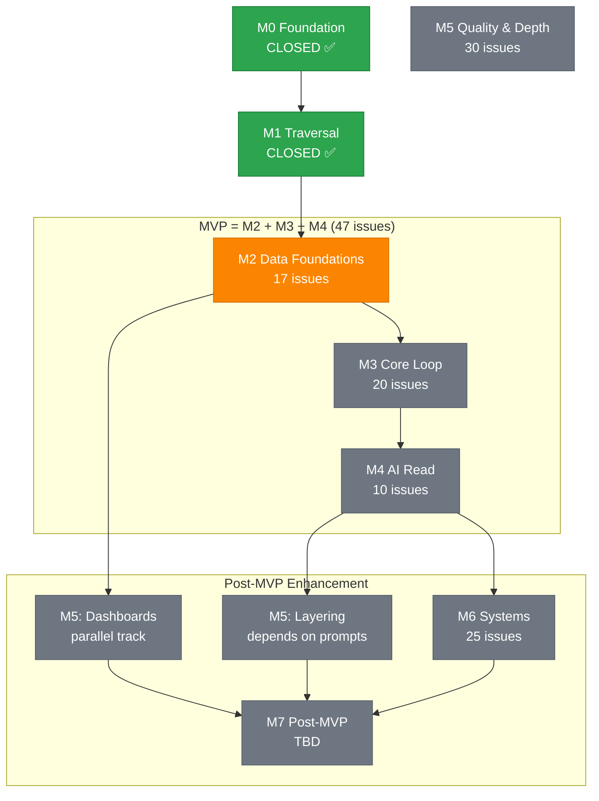

# Roadmap (Milestone Narrative)

This roadmap is organized by **dependency-driven milestones** validated through MECE principles. Each milestone represents a natural cluster of issues with clear boundaries and handoff points, sequenced to deliver MVP incrementally.

## Milestone Overview

| Milestone               | Objective (Why)                            | Core Increments                                                                         | Status                             | Exit Criteria                                                                                       |
| ----------------------- | ------------------------------------------ | --------------------------------------------------------------------------------------- | ---------------------------------- | --------------------------------------------------------------------------------------------------- |
| **M0 Foundation** ✅    | Prove deploy + minimal loop viability      | Ping, guest GUID bootstrap, telemetry scaffold                                          | **CLOSED** 2025-10-19              | Player gets GUID & receives ping consistently                                                       |
| **M1 Traversal** ✅     | Persistent movement across locations       | Location persistence, exit model, move/look commands, direction normalization           | **CLOSED** 2025-10-30              | Player can move across ≥3 persisted locations; telemetry for move success/failure                   |
| **M2 Data Foundations** | Dual persistence + telemetry modernization | SQL API containers, dual persistence implementation, telemetry consolidation            | **50 issues** (39 closed, 11 open) | All mutable data in SQL API; telemetry events enriched with correlation; migration script validated |
| **M3 Core Loop**        | Event processing + player UI               | World event processing, frontend game view, command input, navigation UI                | **20 issues** (0 closed, 20 open)  | Events process via queue; player can navigate via web UI; telemetry shows end-to-end traces         |
| **M4 AI Read**          | Safe advisory AI context only              | MCP servers (world-query, prompt-template), prompt registry, intent parser foundations  | **10 issues** (0 closed, 10 open)  | AI can query world state via MCP; prompts versioned & hashed; intent parser handles basic commands  |
| **M5 Quality & Depth**  | Content enrichment + observability         | Description layering engine, layer validation, dashboards, alerts, integrity monitoring | **30 issues** (5 closed, 25 open)  | Layers applied & audited; dashboards show success rates; alerts fire on anomalies                   |
| **M6 Systems**          | Advanced features + episodic content       | Dungeons, humor layer, entity promotion, Learn More page                                | **25 issues** (0 closed, 25 open)  | At least one dungeon traversable; humor feedback captured; emergent entities promoted               |
| **M7 Post-MVP**         | Extensibility + scale                      | Multiplayer, quests, economy, AI write path, region sharding                            | **TBD**                            | Extensibility hooks functional; multiplayer party coordination prototype                            |

## Dependency Graph (Critical Path to MVP)

The following diagram shows the critical path dependencies between milestone clusters. MVP completion requires M2 → M3 → M4 sequential delivery, while M5 and M6 can proceed in parallel after M4.



### Critical Path Analysis

**Bottleneck**: M2 Data Foundations (17 issues) blocks everything downstream

-   **Duration estimate**: 4-6 weeks
-   **Parallelization**: Limited; most work is sequential (schema → migration → repositories)
-   **Risk**: Schema changes after M2 are expensive; prioritize correctness over speed

**Parallel work opportunities**:

-   M5 Dashboards can start after M2 telemetry consolidation completes
-   M6 Systems planning/design can start during M4 (no code dependencies)

**MVP Completion Path**: M2 (6 weeks) → M3 (5 weeks) → M4 (3 weeks) = **14-16 weeks to MVP**

## M2 Data Foundations (Current Focus)

**Status**: 50 issues (39 closed, 11 open) — 78% complete  
**Goal**: Implement dual persistence (Cosmos SQL API + Gremlin) and modernize telemetry infrastructure  
**Dependencies**: M1 Traversal (CLOSED)  
**Blocks**: M3 Core Loop (#407 World Events Timeline), M5 Dashboards (telemetry complete)  
**Focus**: All non-blocking issues (#256, #318, #347, #393) deferred to M5 to accelerate dual persistence

### Critical Path Issues

**Cluster A: Dual Persistence Implementation** (11 issues) 🔨 **IN PROGRESS (0/7 core + 2 infrastructure + 2 epics)**

**Core Path (7 issues, dependency-driven sequence):**

1. #408 SQL API Repository Abstraction Layer → **START HERE** (foundation)
2. #404 Player State Migration to SQL API → PK: `/id`
3. #405 Inventory Persistence SQL API → PK: `/playerId`
4. #406 Description Layers Storage SQL API → PK: `/locationId`
5. #407 World Events Timeline SQL API → PK: `/scopeKey` **[BLOCKS M3]**
6. #410 Data Migration Script (Gremlin → SQL) → After container implementations
7. #409 Dual Persistence Integration Tests → After migration

**Infrastructure (2 issues, can parallel with core):**

-   #411 Partition Key Strategy Validation & Monitoring
-   #412 Dual Persistence Documentation → Container schemas, ADR updates

**Epic Trackers (2 issues, umbrella only):**

-   #69 Epic: Description Telemetry & Integrity Monitoring
-   #310 Epic: Telemetry Consolidation & Event Enrichment

**Completed:** #403 ✅ World Event Documentation (closed 2025-11-10)

**Cluster B: Telemetry Consolidation** (11 issues) ✅ **COMPLETE (11/11)**

-   #10 ✅ Event Registry Expansion
-   #11 ✅ Gremlin RU Wrapper
-   #41 ✅ Application Insights + OTel Wiring
-   #79 ✅ Gremlin RU + Latency Telemetry
-   #311 ✅ Backend: Telemetry Consolidation → Remove obsolete tracing module
-   #312 ✅ Backend: Event Attribute Enrichment → Player/Location/Event context
-   #315 ✅ Backend: Sampling Configuration (App Insights) → Control telemetry volume
-   #316 ✅ Backend: Event Correlation (operationId + correlationId) → End-to-end tracing
-   #33 ✅ Semantic Exit Names
-   #71 ✅ Gremlin Health Check
-   #318 Backend: Domain Telemetry Event Naming (optional, deferred)

**Cluster B Issues Moved to M3:**

-   #313 Backend: Queue Message CorrelationId Injection
-   #314 Backend: Error Telemetry Normalization
-   #317 Frontend: Telemetry Correlation Headers

**Cluster C: AI Cost Telemetry** (10 issues) ✅ **COMPLETE (10/10)**

-   #50 ✅ Epic: Pre-AI Cost Framework
-   #299-309 ✅ Event registration, pricing, estimation, calculation, aggregation, guardrails, simulation, docs, tests, audit

**Cluster D: Dashboards & Alerts** (14 issues) ✅ **COMPLETE (14/14)**

-   #228-233 ✅ RESTful API Migration (6 issues)
-   #283, #289-298 ✅ Movement dashboards, Performance Ops, RU correlation, alerts, threshold tuning, workbook export

**Cluster E: Integrity Foundation** (3 issues) ✅ **COMPLETE (3/3)**

-   #69 ✅ Epic: Description Telemetry & Integrity Monitoring (umbrella)
-   #152 ✅ Description telemetry events
-   #153 ✅ Integrity hash computation

**Duplicates Closed:** #395-397 ✅ (duplicates of #154-156 in M5)

**Non-Blocking Issues Deferred to M5:**

-   #256 Relative Direction Support (N3 semantic navigation)
-   #318 Domain Telemetry Event Naming Consistency
-   #347 Account Switching Security (localStorage persistence)
-   #393 Humor Telemetry Enumeration & Emission

### Dependency Chains

```
#408 (Abstraction) ──> #404, #405, #406, #407 (Containers, parallel) ──> #410 (Migration) ──> #409 (Tests)
                                                   │
                                                   └──> M3 #101 (Event Schema) [BLOCKED until #407]

Infrastructure (parallel with above): #411 (Partition Monitoring), #412 (Documentation)

#10-#316 (Telemetry Complete) ──> M3 #313, #314, #317 (Queue/Error/Frontend) ──> M3 #422 (Frontend Telemetry)
```

**Sequencing Rationale:**

-   #408 must complete first (foundation layer for all containers)
-   #404-407 can proceed in parallel once #408 is done
-   #410 migration requires containers to exist
-   #409 tests validate both Gremlin + SQL consistency after migration
-   #411-412 can proceed in parallel with core work

### Exit Criteria

-   🔨 All Cosmos SQL API containers provisioned and accessible
-   🔨 Player, Inventory, Layers, Events migrated to SQL API
-   🔨 Dual persistence integration tests pass
-   ✅ Telemetry events enriched with operationId + correlationId
-   🔨 Error telemetry follows classification taxonomy (moved to M3)
-   🔨 Architecture documentation updated with container schemas

### MECE Validation

-   **Mutually Exclusive**: Dual Persistence (A) vs Telemetry (B) vs AI Cost (C) vs Dashboards (D) vs Integrity (E) — no overlap
-   **Collectively Exhaustive**: Covers all mutable data entities + telemetry modernization + cost tracking + observability dashboards + integrity foundation

### Current Status Summary

-   **Complete**: Clusters B (Telemetry), C (AI Cost), D (Dashboards), E (Integrity) — 39 issues ✅
-   **In Progress**: Cluster A (Dual Persistence) — 0/7 core started 🔨
-   **Infrastructure**: 1/3 complete (#403 ✅; remaining: #411, #412)
-   **Deferred to M5**: 4 non-blocking issues (#256, #318, #347, #393) to focus on critical path
-   **Reassigned**: 7 issues moved to M3/M5 for proper sequencing
-   **Duplicates**: #395-397 closed ✅

**M2 Now Focused Entirely on Dual Persistence Critical Path**

**Estimated Time to Complete:** 3-4 weeks

-   Week 1: #408 (abstraction layer)
-   Week 2-3: #404-407 (containers, parallel), #410 (migration)
-   Week 4: #409 (tests), #411-412 (infrastructure/docs)

---

## M3 Core Loop

**Status**: 20 issues (0 closed, 20 open)  
**Goal**: Enable player interaction via web UI with event-driven world processing  
**Dependencies**: M2 Data Foundations (Cluster A: #407 World Events Timeline)  
**Blocks**: M4 AI Read

### Critical Path Issues

**Cluster C: World Event Processing** (8 issues)

-   #101 World Event Schema → Define envelope + payload contracts
-   #102 Queue Processor Function → Azure Functions queue trigger
-   #258 World Event Type-Specific Payload Handlers → Registry/factory pattern for domain logic
-   #398 Correlation ID Injection → Ensure trace continuity
-   #399 Telemetry Constants → Centralized event names
-   #400 World Event Idempotency Tracking → Deduplication store
-   #401 World Event Dead-Letter Storage → Failure persistence
-   #402 World Event Replay Tools → Admin replay capability

**Cluster D: Frontend Player Experience** (12 issues)

-   #418 Authentication Flow (SWA Built-in Auth + GitHub) → Identity foundation
-   #413 Game View Component (Location + Exits + Status) → Main UI container
-   #414 Description Rendering with Layer Composition → Composable layers + sanitization
-   #415 Command Input with Autocomplete & Validation → Input component
-   #416 Directional Navigation UI (Exit Buttons + Shortcuts) → Visual navigation
-   #417 Player Status Panel (Health, Location, Inventory Count) → Persistent status display
-   #419 Client-Side Routing & Navigation → React Router setup
-   #422 Frontend Telemetry Integration (App Insights) → Client-side observability
-   #420 Accessibility Compliance (WCAG 2.1 AA) → _(Can defer to M5)_
-   #421 Responsive Layout (Mobile/Tablet/Desktop) → _(Can defer to M5)_
-   #423 Frontend Integration & E2E Tests (Playwright + RTL) → _(Can defer to M5)_
-   #424 Frontend Architecture Documentation → _(Can defer to M5)_

### Dependency Chains

```
M2:#407 (Events Timeline) ──> #101 (Schema) ──> #102 (Processor) ──> #258 (Handlers)
                                                  │
                                                  └──> #398-#402 (Reliability)

M2:#404 (Player State) ──> #418 (Auth) ──> #413 (Game View) ──> #414-#417, #419 (UI Components)
                                           │
                                           └──> #422 (Telemetry)
```

### Exit Criteria

-   ✅ World events process via Service Bus queue with idempotency
-   ✅ Player can authenticate via SWA GitHub identity
-   ✅ Game view renders location + exits + player status
-   ✅ Command input accepts player commands with validation
-   ✅ Frontend telemetry shows client → backend correlation
-   ✅ At least one event type (e.g., Player.Move) processes with domain logic

### MECE Validation

-   **Mutually Exclusive**: Backend event processing (Cluster C) vs Frontend UI (Cluster D)
-   **Collectively Exhaustive**: Covers event-driven architecture + player interaction surface

---

## M4 AI Read

**Status**: 10 issues (0 closed, 10 open)  
**Goal**: Enable AI to query world state and use versioned prompts (read-only)  
**Dependencies**: M2 Data Foundations (#434 needs SQL), M3 Core Loop (UI for testing)  
**Blocks**: M5 Layering (AI generation), M6 Systems (AI-driven content)

### Critical Path Issues

**Cluster E1: Prompt Registry** (5 issues)

-   #433 Prompt Template Schema → Define versioned template structure
-   #434 Prompt Storage (SQL API) → Store templates with version + hash
-   #435 Prompt Retrieval API → HTTP endpoint for template access
-   #436 Prompt Hashing & Integrity → Ensure reproducibility
-   #438 Prompt Cost Telemetry → Track AI model invocation costs

**Cluster E2: MCP Servers** (5 issues)

-   #425 MCP World Query Tools → Read-only access to locations, exits, players
-   #426 MCP Prompt Template Access → Template retrieval via MCP
-   #427 MCP Telemetry Query → Recent telemetry for AI context
-   #428 MCP Authentication → Identity propagation for auditing
-   #430 MCP Integration Tests → Validate tool contracts

### Dependency Chains

```
M2:#403 (SQL Infra) ──> #433 (Schema) ──> #434 (Storage) ──> #435 (API) ──> #436 (Hashing)
                                                              │
                                                              └──> #438 (Cost)

M2:#404-#407 (Data) ──> #425 (World Query) ──┬──> #428 (Auth) ──> #430 (Tests)
                        #434 (Prompts) ───────┤
                        M2:#312 (Telemetry) ──┘
```

### Exit Criteria

-   ✅ Prompts stored in SQL with versioning + content hash
-   ✅ MCP world-query tool can retrieve location + exit data
-   ✅ MCP prompt-template tool can retrieve templates by ID + version
-   ✅ AI invocations tracked with cost telemetry (model, tokens, latency)
-   ✅ Authentication propagates identity through MCP calls

### MECE Validation

-   **Mutually Exclusive**: Prompt infrastructure (E1) vs MCP tools (E2) are distinct layers
-   **Collectively Exhaustive**: Covers AI context needs (world state + prompts + observability)

**MVP Complete**: After M4, player can navigate a world with AI-enhanced context (read-only)

---

## M5 Quality & Depth (Post-MVP)

**Status**: 30 issues (5 closed, 25 open)  
**Goal**: Add content enrichment via layering + comprehensive observability  
**Dependencies**: M4 AI Read (prompt registry), M2 Telemetry (enriched events)  
**Parallel Tracks**: Dashboards (depends on M2), Layering (depends on M4)

### Parallel Track A: Dashboards & Monitoring (10 issues)

_Can start after M2 Telemetry Consolidation_

-   #281-#283 Movement & Navigation Dashboards
-   #284-#286 Telemetry Catalog Updates & Deprecation
-   #289 Dashboard: RU Consumption by Operation
-   #291 Workbook: Movement Navigation Dashboard
-   #292-#295 Alerts (RU, Partition Pressure, Success Rate, Latency)
-   #297 Post-Baseline Threshold Tuning

### Parallel Track B: Description Layering (20 issues)

_Depends on M4 Prompt Registry_

**Cluster F1: Core Composer** (8 issues)

-   #65 Description Composer Core → Base + structural layer composition
-   #175 Performance Benchmark → Median latency targets
-   #176 Sentence Splitter Abstraction → Pluggable tokenization
-   #177 Composite Hash Order-Invariance Test → Deterministic hashing
-   #178 Layer Ordering Guard → Prevent duplicate provenance
-   #183 Structural Event Simulation: Dry-Run Mode → Preview tool
-   #184 Structural Event Simulation: JSON Output Flag → Automation support
-   #190 Structural Event Simulation: Help & Usage Docs → Onboarding

**Cluster F2: Validation & Quality** (5 issues)

-   #157 Core Layer Validation Rules → Required fields, max length, patterns
-   #158 Similarity & Duplicate Detection → Near-duplicate prevention
-   #159 Layer Validation Fuzz Test Suite → Edge case coverage
-   #160 Validation Config & Dry-Run Mode → Gradual rollout
-   #161 Validation Telemetry Counters → Observability

**Cluster F3: Integrity Monitoring** (3 issues)

-   #154 Integrity Cache Layer → Performance optimization
-   #155 Corruption Simulation Harness → Test infrastructure
-   #156 Integrity Anomaly Alerting → Automated detection

**Cluster F4: Ambient Context** (4 issues)

-   #162 Ambient Context Registry Core → Reusable fragments
-   #163 Ambient Context Pruning & Metrics → Lifecycle management
-   #164 Fallback Resolution Chain → Hierarchical lookup
-   #165 Ambient Registry Benchmark → Performance baseline

### Exit Criteria

-   ✅ Dashboards show movement success rate, RU consumption, latency distributions
-   ✅ Alerts fire on anomalies (RU spikes, partition pressure, success rate drops)
-   ✅ Description composer handles base + structural layers deterministically
-   ✅ Layer validation prevents duplicate/malformed layers
-   ✅ Integrity monitoring detects corruption via hash validation

---

## M6 Systems (Post-MVP)

**Status**: 25 issues (0 closed, 25 open)  
**Goal**: Advanced features (dungeons, humor, entity promotion, DevX)  
**Dependencies**: M4 AI Read (all), M5 Layering (for entity promotion)

### Feature Clusters

**Cluster G: Dungeon Runs** (8 issues from Epic #219)

-   #220 Dungeon Template Vertex Metadata & Tagging
-   #221 Dungeon Run Instance Document Schema (SQL)
-   #222 Dungeon Lifecycle Event Types
-   #223 Entrance Detection & Instance Bootstrap
-   #224 In-Dungeon Movement State Overlay
-   #225 Exit Handling & Run Finalization
-   #226 Dungeon Run Telemetry Constants
-   #227 Instance TTL & Cleanup Policy

**Cluster H: Humor Layer** (7 issues from Epic #323)

-   #328 Humor Telemetry Enumeration
-   #329 Player Humor Feedback Endpoint
-   #330-#335 Humor generation, contextual extraction, reaction capture

**Cluster I: Entity Promotion** (8 issues from Epic #324)

-   #337-#344 Emergent entity detection, latent candidate tracking, promotion pipeline

**Cluster J: DevX & Documentation** (4 issues from Epic #52)

-   #171 Learn More Page Implementation
-   #172 Weekly Learn More Content Regeneration
-   #173 Roadmap Embedding Component
-   #174 Learn More SEO & Analytics

### Exit Criteria

-   ✅ At least one dungeon template traversable with instance state
-   ✅ Humor feedback captured and associated with content
-   ✅ Emergent entities detected and promoted to canonical
-   ✅ Learn More page deployed with automated updates

---

## M7 Post-MVP Extensibility

**Status**: 0 issues (planning)  
**Goal**: Multiplayer, quests, economy, AI write path  
**Dependencies**: M5 + M6 complete

### Planned Tracks

-   Multiplayer synchronization & party state
-   Quest & dialogue branching engine
-   Economy pricing dynamics + trade routes
-   AI proposal validation & mutation gates (write path)
-   Region sharding (partition evolution) per ADR-002 signals

## Prioritization Principles

1. **Critical Path First**: M2 (Data) → M3 (Loop) → M4 (AI) represents MVP; prioritize unblocking downstream work
2. **Risk Reduction Early**: Schema changes (M2) are expensive later; validate partition strategy before enrichment
3. **Parallel Where Possible**: M5 Dashboards can start after M2; M6 planning can start during M4
4. **Read Before Write**: AI read-only (M4) before any world mutation (M7)
5. **Observability Throughout**: Telemetry instrumentation in every milestone

## MECE Validation Summary

Each milestone passes MECE tests:

-   **M2**: Data persistence (SQL) vs Telemetry (enrichment) — no overlap
-   **M3**: Backend processing (events) vs Frontend UI — clean boundary
-   **M4**: Prompt infrastructure vs MCP tools — distinct layers
-   **M5**: Dashboards (parallel track A) vs Layering (parallel track B) — independent
-   **M6**: Feature epics remain separate (dungeons, humor, promotion, DevX)

## Change Process

Material roadmap shifts require updating: this file + affected ADR cross-links. Milestone assignments are the source of truth; see GitHub issues filtered by milestone for detailed dependencies.

Use GitHub REST API to manage milestone assignments and issue dependencies (MCP does not support milestones).

---

**Last updated**: 2025-11-10 (M2 status: 50 issues, 39 closed, 11 open [78%]; #403 documentation completed; 7 core dual persistence issues + 2 infrastructure + 2 epic trackers remaining; clear dependency sequence established for final push)
