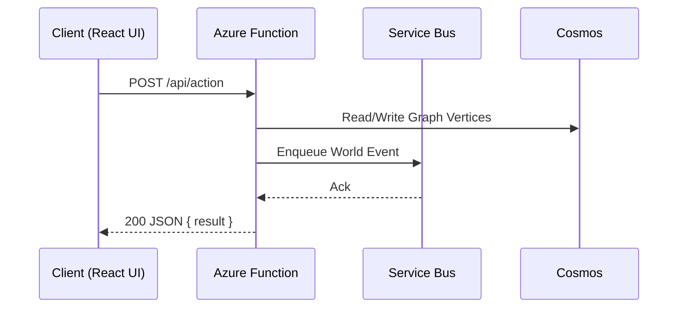

# UX Documentation

This directory centralizes player experience artifacts: wireframes, user flows, interaction notes, and iteration history for The Shifting Atlas.

> Accessibility is a core, non‑negotiable tenet. All UX artifacts must comply with and extend the baseline described in `accessibility-guidelines.md`. New flows cannot be approved while introducing WCAG regressions.

## Goals

1. Provide a lightweight, versioned trail of UX decisions aligned with gameplay modules.
2. Keep artifacts diff‑friendly (Markdown + Mermaid) – no external binary design sources required.
3. Enable rapid iteration without losing historical context.
4. Encode accessibility from inception (see `accessibility-guidelines.md`).

## Structure

```
docs/ux/
  README.md                Overview & conventions (this file)
  wireframes/              Page & component layout specs (Markdown + optional image refs)
  user-flows/              End‑to‑end interaction flows (Mermaid diagrams + narrative)
  templates/               Reusable templates for new artifacts
  assets/                  Exported static images (png/svg) committed for permanence
    .gitkeep
```

## Naming Conventions

Use kebab-case file names that start with a semantic scope and end with version when needed.

Examples:

- `entry-page-wireframe.md`
- `inventory-management-wireframe.v2.md` (deprecated or superseded version kept for history)
- `entry-onboarding-flow.md`

Avoid dates in filenames; rely on Git history + internal metadata front matter for dating.

## Front Matter Metadata

Each artifact begins with a YAML block:

```
---
title: Entry Onboarding Flow
status: draft            # draft | review | approved | deprecated
version: 1.0.0
authors: ["@your-handle"]
updated: 2025-09-15
related:
  modules: ["navigation", "player-identity"]
  components: ["Homepage", "Nav", "DemoForm"]
wireframePrototype: react-live # indicates layout expressed directly in React components
exportedImage: ../assets/entry-onboarding-flow.png        # optional static reference (PNG/SVG) if needed
---
```

## Versioning & Iteration

Minor visual refinements normally update the `updated` date only. Bump `version` when:

- Information architecture changes (add/remove steps/screens)
- Player decision branches are added/removed
- Layout shift that impacts component contracts

If a major conceptual change occurs, keep the old file, set its `status: deprecated`, and create a new file with incremented major version (e.g., 2.0.0).

## Iteration Log Block

Every artifact includes (near the end) an `## Iteration Log` section with reverse‑chronological entries:

```
| Date       | Ver | Change | Rationale | Impact |
|------------|-----|--------|-----------|--------|
| 2025-09-15 |1.0.0| Initial draft | Baseline onboarding path | None |
```

## Mermaid Diagram Guidelines

Use Mermaid for flows and component relationships. Favor:

- `flowchart TD` for linear / branching player actions.
- `sequenceDiagram` for timed interactions (e.g., player -> server -> queue -> db).

Keep diagrams small & focused; split large journeys into linked sub‑flows.

## Linking Code & Gameplay Modules

Reference source code by relative path with backticks (e.g., `frontend/src/components/Homepage.tsx`).
Reference gameplay design modules in `docs/modules/` using bracket links: `[Navigation & Traversal](../modules/navigation-and-traversal.md)`.

## Workflow for Adding a New Artifact

1. Copy a template from `templates/`.
2. Fill metadata front matter.
3. Draft narrative + diagram.
4. Add iteration log initial row.
5. Open PR with label `ux` and checklist:
   - [ ] Links to related modules
   - [ ] Diagram renders locally (preview plugin / Mermaid)
   - [ ] Component names match code
   - [ ] Status = draft
6. Reviewer updates status to `review` or requests changes.
7. When approved, change status to `approved` in same or follow‑up PR.

## Tooling & Representation

- Use Mermaid for flows (`flowchart`, `sequenceDiagram`) and interaction timing.
- Express wireframe layout directly in React: create or modify components under `frontend/src/components/` (or page entries in `frontend/src/pages/`) instead of maintaining a separate drawing file. This keeps implementation and design aligned.
- Optional static PNG/SVG exports (stored in `assets/`) only when clarifying spatial density or visual hierarchy that Mermaid cannot capture.
- VS Code Mermaid preview extensions can help validate diagrams before commit.

### React-as-Wireframe Approach

Rather than exporting images from a sketch tool, create a skeletal implementation:

1. Introduce minimal semantic containers (e.g., `<header>`, `<nav>`, `<main>` placeholders) with Tailwind utility classes for spacing.
2. Use placeholder text blocks (`TODO:` labels) for unfinished interactive elements.
3. Commit these early; they serve as both living documentation and reviewable diff.
4. When fidelity increases, evolve the same components—no separate synchronization step.

### Mermaid Tips

Keep diagrams narrowly scoped. If a flow exceeds ~25 nodes or a sequence exceeds ~12 messages, split it into linked sub‑documents.

Example sequence snippet:



## Housekeeping

- Prune `deprecated` artifacts quarterly.
- Ensure every approved user flow maps to at least one QA test scenario (future automation hook).
- Validate against accessibility checklist (landmarks, focus order, keyboard traversal) before status moves to `review`.

---

For questions: open an issue with label `ux`.

See also: `accessibility-guidelines.md` for mandatory patterns.
