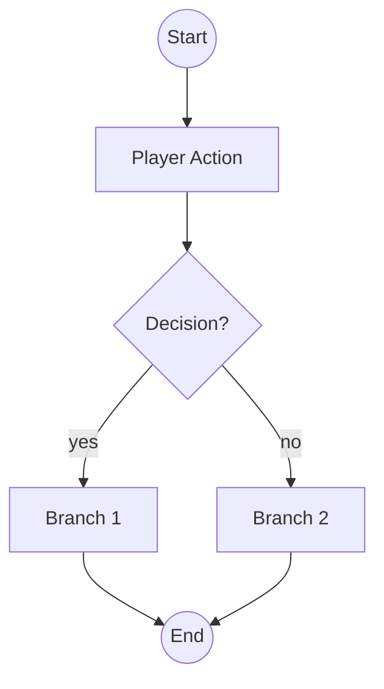
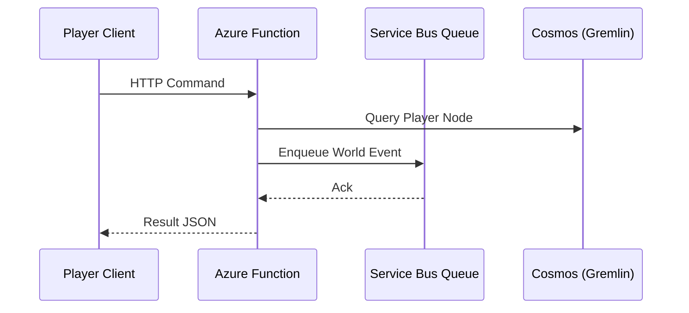

# {Flow Title}

## Overview

Short description.

## Trigger

Entry condition (player state, location, prerequisite event).

## Success Criteria

-

## Primary Flow

````


## Alternate / Failure Paths
| Path | Cause | System Response | Recovery |
|------|-------|-----------------|----------|

## Sequence (System Perspective)
```



```

## Data Touchpoints
| Entity | Operation | Notes |
|--------|-----------|-------|

## Metrics & Telemetry
List events to emit (e.g., `Flow.Entry`, `Flow.Complete`, `Flow.Abort`).

## Open Questions
-

## Iteration Log
| Date | Ver | Change | Rationale | Impact |
|------|-----|--------|-----------|--------|
| 2025-09-15 | 0.1.0 | Initial draft | Baseline | None |
```
