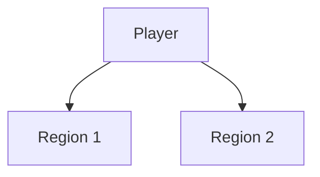

# {Title}

## Purpose

Concise statement why this screen / component exists.

## Primary Player Goals

-

## Layout Overview

Describe major regions.

````


## Components
| Component | Source Path | Description | Notes |
|-----------|-------------|-------------|-------|
| ExampleComponent | `frontend/src/components/Example.tsx` | Short role | Future enhancements |

## Interaction Hotspots
| Element | Action | Resulting State / Event | Queued World Event? |
|---------|--------|-------------------------|---------------------|

## Accessibility Considerations
List keyboard nav, ARIA roles, focus order, color contrast assumptions.

## Open Questions
-

## Iteration Log
| Date | Ver | Change | Rationale | Impact |
|------|-----|--------|-----------|--------|
| 2025-09-15 | 0.1.0 | Initial draft | Baseline | None |
```
