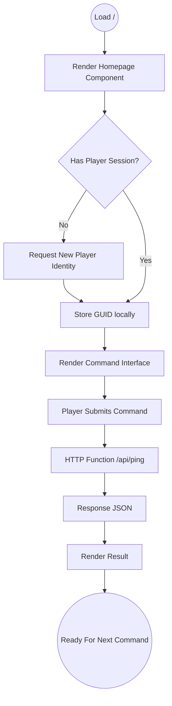
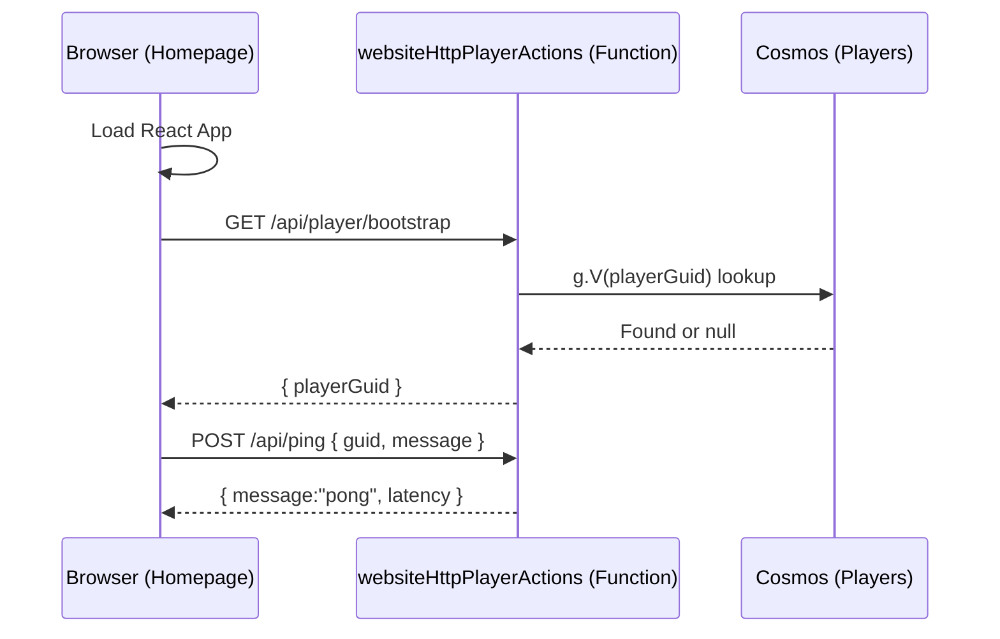

# Homepage Onboarding Flow

## Overview

Defines how a first‑time or returning (unauthenticated) player reaches a usable command interface and (optionally) upgrades to an authenticated profile. A temporary guest identity (GUID) is created lazily (only when a server interaction requires persistence) and can later be merged with an external identity.

This document focuses on: frictionless first command, reversible guest decisions, and a secure / lossless upgrade path. It excludes long‑term personalization or deep social systems.

---

## Personas (Lightweight)

| Persona              | Short Description                    | Primary Need in First 60s      | Risk if Unmet                     |
| -------------------- | ------------------------------------ | ------------------------------ | --------------------------------- |
| Curious Visitor      | Arrives from a link / social mention | See something reactive quickly | Bounce before issue first command |
| Systems Explorer     | Reads docs, wants to poke mechanics  | Transparent command feedback   | Perceives black box -> churn      |
| Returning Guest      | Has prior guest GUID locally         | Resume seamlessly              | Frustration / duplicate profile   |
| Authenticated Player | Previously linked external identity  | Persist progress & identity    | Perceived data loss               |

Assumption: Mobile (~40%) + Desktop (~60%) split; must remain single‑input friendly (keyboard OR touch) without mandatory multi‑modal interactions.

---

### Goals

- Fast time‑to‑first‑command (< 10s typical; stretch < 5s on broadband)
- Minimize friction before value (guest path always available, never blocked by auth)
- Seamless upgrade from guest to authenticated account (no data divergence)
- Provide clear system feedback (loading, error, success states) with accessible patterns
- Ensure telemetry needed for cohort analysis is emitted with stable keys

### Non‑Goals (Out of Scope)

- Full player profile customization
- Social / friends graph
- Account recovery / password reset flows
- Deep tutorial scripting (will reference separate tutorial doc later)

## Trigger

Player navigates to site root `/` without a valid session / auth cookie OR with an expired / invalidated session.

## Actors

| Actor                | Role / Responsibility                                       |
| -------------------- | ----------------------------------------------------------- |
| Player (Guest)       | Unauthenticated visitor; may become authenticated           |
| Authenticated Player | Returning user with external identity session               |
| Static Web App (SWA) | Delivers SPA & handles built‑in auth redirects              |
| Azure Functions API  | Processes bootstrap, ping, profile sync, telemetry capture  |
| Cosmos DB            | Stores Player vertex and minimal session linkage            |
| Service Bus (future) | Will process queued onboarding / analytics events (planned) |

## Preconditions

- Application build loads successfully (no blocking JS errors)
- Network reachable for at least one bootstrap OR command request (offline deferred)
- Feature flags (if any) for onboarding resolved prior to first command input enable

## Postconditions (Happy Path)

- Player receives a GUID (guest) OR reuses existing playerGuid (returning)
- Player can submit a command and receive a response
- (If authenticated) Player profile synchronized with external identity
- Telemetry events for Onboarding.Start and Onboarding.FirstCommandSuccess emitted

## Success Criteria

- Command interface visible with navigation (no blocking spinners post 2s)
- Guest GUID created only when a command is attempted OR when a stateful feature (like save) is touched
- First command round‑trip completes (< 1s p50 local; < 1.5s p50 prod target TBD)
- Auth upgrade preserves progress (guest GUID linked, not discarded)
- Accessibility: initial interactive control reachable via keyboard (tab index 0/first)
- No console errors at INFO level or higher after happy path run

## UX State Map

| State Key        | Description                               | Entry Condition                  | Exit Condition                | Visible Elements                       | Notes                             |
| ---------------- | ----------------------------------------- | -------------------------------- | ----------------------------- | -------------------------------------- | --------------------------------- |
| loading-shell    | App JS/CSS load & initial render skeleton | Document ready                   | React hydration complete      | Logo, progress indicator               | Avoid large LCP images            |
| checking-session | Validate existing GUID or auth            | App hydrated                     | Session decision (guest/auth) | Subtle inline loader near command area | < 500ms target                    |
| ready-guest      | Guest command interface active            | Session check done (guest)       | Auth upgrade or navigate away | Command input, guest CTA to upgrade    | Show low-friction upgrade CTA     |
| ready-auth       | Authenticated interface active            | Auth session validated           | Sign out                      | Command input, profile summary         | Display name/avatar stub optional |
| upgrading-auth   | Linking guest GUID to auth                | User initiates auth              | Receive callback or failure   | Spinner overlay, cancel (optional)     | Timeout fallback 10s              |
| error-transient  | Recoverable error (network)               | Failed request w/ retryable code | Retry success or user abort   | Inline alert, retry button             | Distinct from fatal               |
| error-fatal      | Non-recoverable (script/init)             | Critical JS failure              | Page reload                   | Error panel, reload CTA                | Capture telemetry immediately     |

## Primary Flow (Guest First Use)



## Alternate / Failure Paths

| Path | Scenario                       | System Response        | Recovery / UX Copy                        | Telemetry Event         |
| ---- | ------------------------------ | ---------------------- | ----------------------------------------- | ----------------------- |
| AF1  | Network failure on bootstrap   | Non-blocking retry UI  | Retry button; suggest checking connection | Onboarding.NetworkError |
| AF2  | Ping function 5xx              | Error toast            | User retries; degrade to canned response  | Command.Error.5xx       |
| AF3  | GUID creation conflict (rare)  | Regenerate & log       | Silent fallback; telemetry event emitted  | Onboarding.GuidConflict |
| AF4  | Auth provider redirect failure | Display auth error box | Offer guest path + retry auth             | Auth.RedirectFailure    |
| AF5  | Profile sync validation error  | Modal with details     | Retry sync / keep guest until resolved    | Auth.ProfileSyncError   |
| AF6  | Session decode malformed       | Force new guest GUID   | Inform user session expired, continue     | Session.DecodeError     |
| AF7  | Command timeout (>5s)          | Inline timeout notice  | Offer retry; keep input contents          | Command.Timeout         |

## Sequence (System Perspective – Guest)



## Data Touchpoints

| Entity            | Operation                              | Notes                                       |
| ----------------- | -------------------------------------- | ------------------------------------------- |
| Players (vertex)  | Create if missing                      | Minimal stub until profile completion       |
| Events            | (future) enqueue onboarding completion | Not implemented yet                         |
| Sessions (in-mem) | N/A (derived)                          | Derived from GUID + optional auth principal |

## Metrics & Telemetry

| Event                          | Type    | Dimensions (min set)                  | Notes                            |
| ------------------------------ | ------- | ------------------------------------- | -------------------------------- | ------------------------------------- |
| Onboarding.Start               | counter | clientTs, uaHash, buildId             | Fire before network call         |
| Onboarding.GuestGuidCreated    | counter | creationMode (lazy                    | eager), buildId                  | Distinguish path                      |
| Onboarding.FirstCommandSuccess | timer   | latencyMs, buildId, networkRTTbucket  | Use high‑res timer               |
| Auth.UpgradeInitiated          | counter | guestGuidPresent (bool), providerHint | ProviderHint from button context |
| Auth.UpgradeSuccess            | counter | provider, linkStrategy (merge         | new), hadGuestProgress           | Ensure merge vs new identity analysis |
| Onboarding.NetworkError        | counter | phase (bootstrap                      | ping), errorClass                | Derived from AF1                      |
| Command.Error.5xx              | counter | functionName, statusCode              | Derived from AF2                 |
| Command.Timeout                | counter | functionName, timeoutMs               | AF7                              |
| Auth.ProfileSyncError          | counter | validationIssue                       | AF5                              |
| Session.DecodeError            | counter | tokenVersion, decodePhase             | AF6                              |

Schema Stability Principle: avoid renaming events post instrumentation; prefer additive fields.

Retention: At least 30 days raw events; aggregated metrics longer.

Privacy: No PII beyond hashed user agent and stable GUID (guest) or provider opaque IDs.

> Component Note: Interaction surface is now a composed `CommandInterface` which embeds `CommandInput` (entry) and `CommandOutput` (history + live announcements). Deprecated `DemoForm` removed.

## API Contract (Current & Planned)

| Endpoint                       | Method | Auth Required   | Purpose                         | Request Body (min)                | Response (shape)                          |
| ------------------------------ | ------ | --------------- | ------------------------------- | --------------------------------- | ----------------------------------------- |
| /api/player/bootstrap          | GET    | No              | Return (or allocate) guest GUID | n/a                               | { playerGuid: string, created?: boolean } |
| /api/ping                      | POST   | No              | Test round‑trip & latency       | { guid: string, message: string } | { message: string, latency?: number }     |
| /api/player/sync-profile       | POST   | Yes (principal) | Link auth identity to player    | { externalClaimsHash?: string }   | { playerGuid: string, merged: boolean }   |
| /api/player/telemetry (future) | POST   | No (signed?)    | Client event funnel (batched)   | { events: Event[] }               | { accepted: number }                      |

Error Envelope (pattern): { error: { code: string, message: string, retryable: boolean } }

## Data Model (Simplified)

Player Vertex (initial fields only):

```jsonc
{
    "id": "<playerGuid>",
    "type": "Player",
    "createdUtc": "2025-09-19T00:00:00Z",
    "guest": true,
    "auth": { "providers": [] },
    "progress": { "firstCommandUtc": null }
}
```

On auth merge append provider descriptor:

```jsonc
"auth": { "providers": [ { "provider": "aad", "externalId": "<oid>" } ] },
"guest": false
```

## Accessibility Considerations

- All actionable onboarding controls have discernible text (ARIA labels where icon‑only)
- Color contrast for status / error messages meets WCAG AA (contrast >= 4.5:1)
- Loading state not solely color; includes role="status" aria-live="polite"
- Command input auto-focused only if it doesn’t steal focus from assistive tech (respect user preference / reduce motion settings for animations)
- Provide skip link to jump directly to command interface for keyboard users

## Risks & Mitigations

| Risk                      | Impact              | Likelihood | Mitigation                                        |
| ------------------------- | ------------------- | ---------- | ------------------------------------------------- |
| GUID duplication edge     | Data merge issues   | Very Low   | Server-side GUID generation + conflict retry      |
| Latency spikes            | Delayed first value | Medium     | Minimal payload, CDN assets, measure p50/p95      |
| Auth redirect loop        | User abandonment    | Low        | Detect consecutive failures; offer guest fallback |
| Silent telemetry drop     | Lost insights       | Medium     | Batch with retry & console warn on fail           |
| Accessibility regressions | Exclusion of users  | Medium     | Add automated axe-core scan in CI                 |

## Future Enhancements (Not in 1.2.0)

- Guided progressive tutorial overlay after 2nd successful command
- Lightweight offline cache enabling command queueing
- Multi-tab coordination for single active session focus
- Event-driven onboarding completion badge (Service Bus + Events collection)

## Open Questions (Pending)

- Persist tutorial edge immediately or after first successful command?
- Should advanced commands require auth or just rate-limit guests?
- Do we surface a minimal privacy notice pre-auth or post-auth only?
- Where to surface latency insight (inline vs dev-only console)?
- Do we unify telemetry ingestion via separate function or piggyback existing endpoints?

## Iteration Log

| Date       | Ver   | Change                                                                                           | Rationale                                              | Impact |
| ---------- | ----- | ------------------------------------------------------------------------------------------------ | ------------------------------------------------------ | ------ |
| 2025-09-15 | 1.0.0 | Initial draft                                                                                    | Establish baseline onboarding                          | None   |
| 2025-09-16 | 1.1.0 | Added auth flow & refined structure                                                              | Clarity + guest/auth upgrade                           | Low    |
| 2025-09-19 | 1.2.0 | Streamlined doc; added personas, UX states, API contract, telemetry schema, accessibility, risks | Comprehensive coverage & readiness for instrumentation | Medium |
| 2025-09-19 | 1.2.2 | Replaced DemoForm with CommandInterface (CommandInput + CommandOutput)                           | Reflect architecture & component responsibilities      | Low    |
| 2025-09-28 | 1.2.3 | Fixed "Create Your Explorer" button + added future character creation documentation              | Resolve button state bug & document expansion plans    | Low    |

## Signup / Login Flow (Azure External Identities)

See also: `docs/ux/azure-auth-notes.md` for developer implementation details.

We integrate Azure Static Web Apps built‑in auth with Azure External Identities (Azure AD / B2C) so players can optionally authenticate after (or before) issuing their first command.

### User Journey

1. User clicks "Sign up / Log in" on the `Homepage` or `Nav`.
2. The client opens the provider sign-in page (Azure SWA built-in auth redirects to the configured identity provider).
3. After successful auth the SWA platform issues an authentication cookie and (for APIs) injects a base64-encoded `x-ms-client-principal` header into proxied requests to the backend. The client is redirected back to the SPA.
4. On return the SPA reads ephemeral info from the endpoint `/.auth/me` (or the platform-provided auth JSON) to obtain basic claims (email, name, identity provider, object id).
5. The client then calls `POST /api/player/sync-profile` with the auth claims (id, email, name, provider). The Function validates the header/jwt and creates or updates the player vertex in Cosmos DB, linking any existing local GUID if present.
6. The SPA stores a lightweight local session flag (we prefer server-validated tokens or HttpOnly cookies for sensitive tokens; see backend guidance). The player is now fully authenticated and can access gated features (saved characters, friends, cross-device sync).

### UX Considerations

- Provide both a "Continue as guest" path (current onboarding stub GUID behavior) and a clear "Sign up / Log in" CTA. Guests can convert to an identity later.
- When the user finishes provider auth, show a short confirmation modal that maps the external identity to an in-game profile and asks to complete an optional display name and avatar.
- For first-time external logins, surface a brief data usage / privacy notice and an option to link an existing guest profile using an emailed verification link or an in-app code.

### Backend Validation & Security Contract

- Input: requests from the SPA with either the platform auth header (`x-ms-client-principal`) forwarded by Static Web Apps or an Authorization: Bearer <JWT> if you opt to use auth tokens directly.
- Output: Created/updated Player vertex in Cosmos DB, returns canonical playerGuid and role claims.
- Error modes: header missing/invalid, provider mismatch, profile conflict.

Key checks the backend must perform:

1. If `x-ms-client-principal` is present, validate it is coming from the SWA host (Functions receive it when proxied) and decode the base64 body to extract claims.
2. Optionally validate the raw JWT (if using Authorization bearer tokens) against the provider's JWKS endpoint.
3. Use a stable external id (for example, `sub` or `oid` claim combined with provider) as the canonical link to the Player vertex.

### Implementation Snippets

#### staticwebapp.config.json excerpt

```jsonc
{
    "routes": [{ "route": "/api/*", "allowedRoles": ["authenticated"] }],
    "auth": {
        "identityProviders": {
            "azureActiveDirectory": {
                "registration": {
                    // Single-tenant locked (see repo README for tenant id rationale)
                    "openIdIssuer": "https://login.microsoftonline.com/fecae6e9-696f-46e4-b1c8-5b471b499a24/v2.0"
                }
            }
        }
    }
}
```

> Note: To revert to a dynamic / multi-tenant friendly setup, replace the hard-coded issuer with `https://login.microsoftonline.com/<TENANT_ID>/v2.0` and add a build/deploy substitution step.

#### Azure Function (decode principal) – TypeScript snippet

```ts
const principalHeader = req.headers['x-ms-client-principal'] as string | undefined
let principal: any | undefined
if (principalHeader) {
    const decoded = Buffer.from(principalHeader, 'base64').toString('utf8')
    principal = JSON.parse(decoded)
    // principal.identityProvider, principal.userId, principal.userDetails, principal.userRoles
}
```

### Edge Cases

- User signs up using multiple external providers (linking): offer a profile linking UI that verifies control of both accounts (e.g., login to each provider and confirm linking).
- Guests who later sign up: attempt heuristic match by email to merge profiles; require explicit confirmation if potential conflict.
- Offline/slow networks: keep guest session locally and queue sync after auth completes.

### Acceptance Criteria

| Category         | Criteria                                                                                |
| ---------------- | --------------------------------------------------------------------------------------- |
| Guest Onboarding | First command possible without auth; GUID created lazily or upfront with < 1 extra RTT. |
| Auth Upgrade     | Guest progress (GUID) merges with authenticated profile without duplication.            |
| Security         | Auth-only routes reject requests lacking valid principal/JWT.                           |
| Performance      | First command round-trip p50 < 1s (local dev baseline).                                 |
| Resilience       | Failure paths AF1–AF5 produce clear, actionable UI feedback.                            |
| Telemetry        | All planned events fire with required dimensions.                                       |

## Explorer Creation vs Sign In Flow

### Current Implementation (as of v1.2.3)

The Homepage component displays two different CTAs based on user state:

- **"Create Your Explorer"** for first-time visitors (`isNewUser = true`)
- **"Sign In to Continue"** for returning visitors (`isNewUser = false`)

Both buttons currently trigger the same authentication flow (`signIn('msa', '/')`), but with an important difference:

- **"Create Your Explorer"** calls `acknowledge()` from `useVisitState` before authentication, marking the user as having visited
- **"Sign In to Continue"** proceeds directly to authentication

This ensures that after a user clicks "Create Your Explorer", subsequent visits will show the "Sign In to Continue" button instead.

### Bug Fix (resolved)

**Issue**: The "Create Your Explorer" button was not calling `acknowledge()`, causing it to appear on every visit even for returning users.

**Solution**: Modified the `onClick` handler to call `acknowledge()` when `isNewUser` is true:

```tsx
onClick={() => {
    if (isNewUser) {
        acknowledge()
    }
    signIn('msa', '/')
}}
```

### Future Enhancement: D&D Style Character Creation

**Vision**: The "Create Your Explorer" button will eventually expand beyond simple authentication to provide a rich character creation experience similar to D&D character builders.

**See Full Documentation**: For complete details on the planned D&D-style explorer creation system, including class selection, attributes, backgrounds, equipment, and phased rollout plan, refer to:
- **`docs/modules/explorer-creation-future.md`** - Comprehensive future vision for explorer creation

**Quick Summary** (see full doc for details):

- Character class selection (Cartographer, Wanderer, Scout, Chronicler, Pathfinder, Emissary)
- D&D-style attributes (Perception, Endurance, Intellect, Charisma, Agility, Wisdom)
- Rich backgrounds with narrative hooks and starting bonuses
- Equipment packs and optional heirloom items
- Personal goal setting for AI-personalized content
- Quick start option for immediate gameplay

**Technical Considerations**:

- Character creation flow will remain optional - users can still choose a "Quick Start" path
- New user state management will expand beyond simple localStorage flag to include creation progress
- Character data will be stored as part of the Player vertex in Cosmos DB
- The current authentication flow will be preserved as the final step after character customization

**UX Flow** (planned):

1. User clicks "Create Your Explorer"
2. Character creation wizard opens (multi-step modal or dedicated pages)
3. User customizes their explorer (class, attributes, background)
4. User completes or skips creation wizard
5. Authentication flow begins (`signIn('msa', '/')`)
6. Character data syncs with authenticated profile

This enhancement will differentiate the "Create Your Explorer" experience from "Sign In to Continue" while maintaining backward compatibility with the current authentication system.
