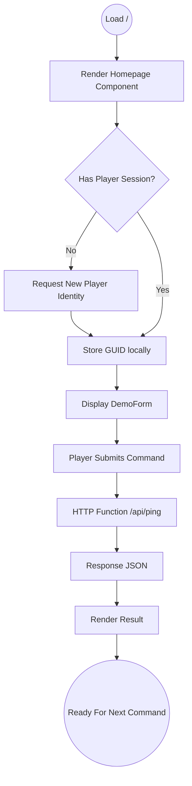
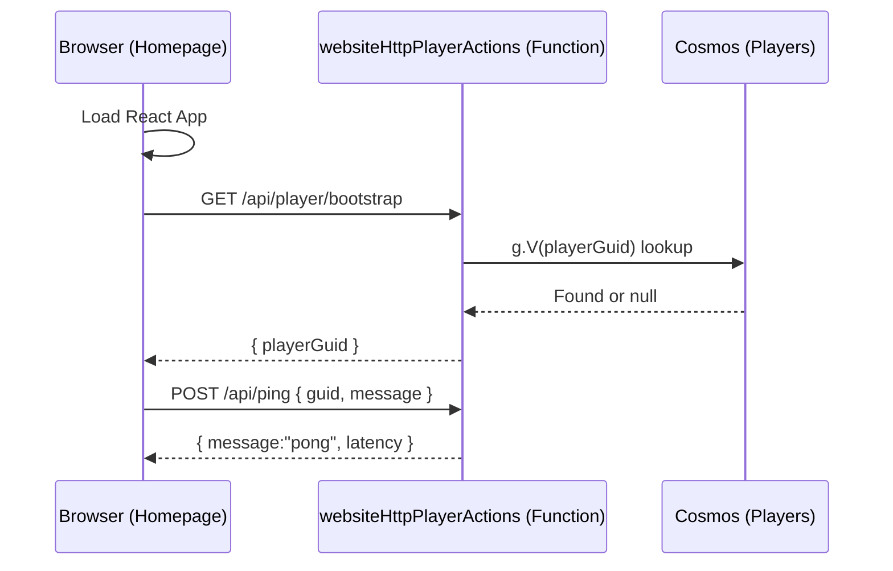

# Homepage Onboarding Flow

## Overview

Defines how a first‑time or returning (unauthenticated) player reaches a usable command interface and (optionally) upgrades to an authenticated profile. A temporary guest identity (GUID) is created only when needed; it can later be merged with an external identity.

### Goals

- Fast time‑to‑first‑command (< 10s on average connection)
- Minimize friction before value (guest path always available)
- Seamless upgrade from guest to authenticated account

### Non‑Goals (out of scope in this doc)

- Full player profile customization
- Social / friends graph
- Account recovery flows

## Trigger

Player navigates to site root `/` without a valid session / auth cookie.

## Actors

| Actor                | Role                                                     |
| -------------------- | -------------------------------------------------------- |
| Player (Guest)       | Unauthenticated visitor; may become Authenticated Player |
| Authenticated Player | User returning with external identity session            |
| Static Web App (SWA) | Delivers SPA & handles built‑in auth redirects           |
| Azure Functions API  | Processes bootstrap, ping, profile sync                  |
| Cosmos DB            | Stores Player vertex                                     |

## Preconditions

- Application build loads successfully.
- Network reachable for at least one initial request (offline flow not covered here).

## Postconditions (Happy Path)

- Player receives a GUID (guest) OR reuses existing playerGuid (returning).
- Player can submit a command and receive a response.
- (If authenticated) Player profile synchronized with external identity.

## Success Criteria

- Command interface visible with navigation.
- Guest GUID created only when a command is attempted (lazy creation) or earlier if UI requires it.
- First command round‑trip completes (< 1s p50 in local dev; production target TBD).
- Auth upgrade preserves progress (guest GUID linked not discarded).

## Primary Flow (Guest First Use)



## Alternate / Failure Paths

| Path | Scenario                       | System Response        | Recovery / UX Copy                        |
| ---- | ------------------------------ | ---------------------- | ----------------------------------------- |
| AF1  | Network failure on bootstrap   | Non-blocking retry UI  | Retry button; suggest checking connection |
| AF2  | Ping function 5xx              | Error toast            | User retries; degrade to canned response  |
| AF3  | GUID creation conflict (rare)  | Regenerate & log       | Silent fallback; telemetry event emitted  |
| AF4  | Auth provider redirect failure | Display auth error box | Offer guest path + retry auth             |
| AF5  | Profile sync validation error  | Modal with details     | Retry sync / keep guest until resolved    |

## Sequence (System Perspective – Guest)



## Data Touchpoints

| Entity           | Operation                              | Notes                                 |
| ---------------- | -------------------------------------- | ------------------------------------- |
| Players (vertex) | Create if missing                      | Minimal stub until profile completion |
| Events           | (future) enqueue onboarding completion | Not implemented yet                   |

## Metrics & Telemetry (Planned)

| Event                          | When                           | Notes                              |
| ------------------------------ | ------------------------------ | ---------------------------------- |
| Onboarding.Start               | App load before bootstrap call | Include user agent hash            |
| Onboarding.GuestGuidCreated    | GUID allocated                 | Distinguish lazy vs eager creation |
| Onboarding.FirstCommandSuccess | First successful ping          | Record latency buckets             |
| Auth.UpgradeInitiated          | User clicks Sign up / Log in   | Capture current guestGuid          |
| Auth.UpgradeSuccess            | Profile linked                 | Include provider & link strategy   |

## Open Questions (Pending)

- Persist tutorial edge immediately or after first successful command?
- Should advanced commands require auth or just rate-limit guests?
- Do we surface a minimal privacy notice pre-auth or post-auth only?

## Iteration Log

| Date       | Ver   | Change                              | Rationale                     | Impact |
| ---------- | ----- | ----------------------------------- | ----------------------------- | ------ |
| 2025-09-15 | 1.0.0 | Initial draft                       | Establish baseline onboarding | None   |
| 2025-09-16 | 1.1.0 | Added auth flow & refined structure | Clarity + guest/auth upgrade  | Low    |

## Signup / Login Flow (Azure External Identities)

See also: `docs/ux/azure-auth-notes.md` for developer implementation details.

We integrate Azure Static Web Apps built‑in auth with Azure External Identities (Azure AD / B2C) so players can optionally authenticate after (or before) issuing their first command.

### User Journey

1. User clicks "Sign up / Log in" on the `Homepage` or `Nav`.
2. The client opens the provider sign-in page (Azure SWA built-in auth redirects to the configured identity provider).
3. After successful auth the SWA platform issues an authentication cookie and (for APIs) injects a base64-encoded `x-ms-client-principal` header into proxied requests to the backend. The client is redirected back to the SPA.
4. On return the SPA reads ephemeral info from the endpoint `/.auth/me` (or the platform-provided auth JSON) to obtain basic claims (email, name, identity provider, object id).
5. The client then calls `POST /api/player/sync-profile` with the auth claims (id, email, name, provider). The Function validates the header/jwt and creates or updates the player vertex in Cosmos DB, linking any existing local GUID if present.
6. The SPA stores a lightweight local session flag (we prefer server-validated tokens or HttpOnly cookies for sensitive tokens; see backend guidance). The player is now fully authenticated and can access gated features (saved characters, friends, cross-device sync).

### UX Considerations

- Provide both a "Continue as guest" path (current onboarding stub GUID behavior) and a clear "Sign up / Log in" CTA. Guests can convert to an identity later.
- When the user finishes provider auth, show a short confirmation modal that maps the external identity to an in-game profile and asks to complete an optional display name and avatar.
- For first-time external logins, surface a brief data usage / privacy notice and an option to link an existing guest profile using an emailed verification link or an in-app code.

### Backend Validation & Security Contract

- Input: requests from the SPA with either the platform auth header (`x-ms-client-principal`) forwarded by Static Web Apps or an Authorization: Bearer <JWT> if you opt to use auth tokens directly.
- Output: Created/updated Player vertex in Cosmos DB, returns canonical playerGuid and role claims.
- Error modes: header missing/invalid, provider mismatch, profile conflict.

Key checks the backend must perform:

1. If `x-ms-client-principal` is present, validate it is coming from the SWA host (Functions receive it when proxied) and decode the base64 body to extract claims.
2. Optionally validate the raw JWT (if using Authorization bearer tokens) against the provider's JWKS endpoint.
3. Use a stable external id (for example, `sub` or `oid` claim combined with provider) as the canonical link to the Player vertex.

### Implementation Snippets

#### staticwebapp.config.json excerpt

```jsonc
{
    "routes": [{ "route": "/api/*", "allowedRoles": ["authenticated"] }],
    "auth": {
        "identityProviders": {
            "azureActiveDirectory": {
                "registration": {
                    // Single-tenant locked (see repo README for tenant id rationale)
                    "openIdIssuer": "https://login.microsoftonline.com/fecae6e9-696f-46e4-b1c8-5b471b499a24/v2.0",
                },
            },
        },
    },
}
```

> Note: To revert to a dynamic / multi-tenant friendly setup, replace the hard-coded issuer with `https://login.microsoftonline.com/<TENANT_ID>/v2.0` and add a build/deploy substitution step.

#### Azure Function (decode principal) – TypeScript snippet

```ts
const principalHeader = req.headers['x-ms-client-principal'] as string | undefined;
let principal: any | undefined;
if (principalHeader) {
    const decoded = Buffer.from(principalHeader, 'base64').toString('utf8');
    principal = JSON.parse(decoded);
    // principal.identityProvider, principal.userId, principal.userDetails, principal.userRoles
}
```

### Edge Cases

- User signs up using multiple external providers (linking): offer a profile linking UI that verifies control of both accounts (e.g., login to each provider and confirm linking).
- Guests who later sign up: attempt heuristic match by email to merge profiles; require explicit confirmation if potential conflict.
- Offline/slow networks: keep guest session locally and queue sync after auth completes.

### Acceptance Criteria

| Category         | Criteria                                                                                |
| ---------------- | --------------------------------------------------------------------------------------- |
| Guest Onboarding | First command possible without auth; GUID created lazily or upfront with < 1 extra RTT. |
| Auth Upgrade     | Guest progress (GUID) merges with authenticated profile without duplication.            |
| Security         | Auth-only routes reject requests lacking valid principal/JWT.                           |
| Performance      | First command round-trip p50 < 1s (local dev baseline).                                 |
| Resilience       | Failure paths AF1–AF5 produce clear, actionable UI feedback.                            |
| Telemetry        | All planned events fire with required dimensions.                                       |
